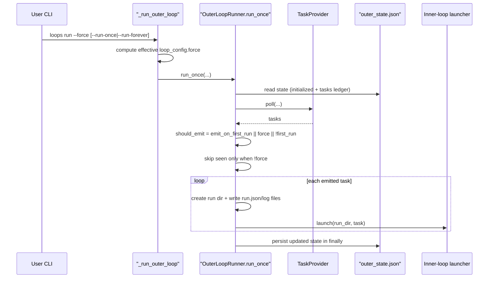

# Force Option Flow

Last updated: 2026-03-01

## Purpose / Question Answered

This document explains what happens when the outer loop is run with force behavior enabled (`loops run --force` or implied force via `--task-url`).
It answers how force changes selection semantics, dedupe behavior, and run materialization for already-seen tasks.

## Entry points

- `loops/cli.py:run_command`: accepts `--force/--no-force` and `--task-url`.
- `loops/cli.py:_run_outer_loop`: resolves effective `loop_config.force` and run mode.
- `loops/outer_loop.py:OuterLoopRunner.run_once`: applies emit/dedupe gates using `self.config.force`.
- `loops/outer_loop.py:OuterLoopState.has_task` and `loops/outer_loop.py:OuterLoopState.record_task`: dedupe ledger read/write used by force gating.

## Call path

### Phase 1: CLI force resolution and config override

Trigger / entry condition:
- Operator executes `python -m loops run ...` with either explicit `--force`/`--no-force` or `--task-url`.

Entrypoints:
- `loops/cli.py:run_command`
- `loops/cli.py:_run_outer_loop`

Ordered call path:
- CLI parses `--force` as tri-state (`True`, `False`, or `None` when omitted).
- `_run_outer_loop` loads config and copies `config.loop_config` to `effective_loop_config`.
- If `task_url` is set, `_run_outer_loop` sets `force_override=True` and `sync_mode=True`.
- Else, `force_override` is the CLI `force` value (or `None`).
- If `force_override is not None`, replace `effective_loop_config.force` with the override.
- Build `OuterLoopRunner` using the effective loop config and call `run_once(...)` or `run_forever(...)`.

State transitions / outputs:
- Input: CLI args + persisted config (`loop_config.force` default/value).
- Output: runtime `OuterLoopRunner.config.force` used by downstream selection logic.

Branch points:
- `task_url != None`: force is always enabled for that invocation and `run_once` is implied.
- `force == None`: runtime uses `loop_config.force` from config file unchanged.
- `force == False`: runtime explicitly disables force even if config has force enabled.

External boundaries:
- None identified.

#### Sudocode (Phase 1: CLI force resolution and config override)

```ts
// Source: loops/cli.py
function run_command(config_path, run_once, limit, force, task_url):
  _run_outer_loop(config_path, run_once, limit, force, task_url)

function _run_outer_loop(config_path, run_once, limit, force, task_url):
  config = load_config(config_path)
  effective = config.loop_config

  if task_url is not null:
    force_override = true
    effective = replace(effective, sync_mode=true)
  else:
    force_override = force

  if force_override is not null:
    effective = replace(effective, force=force_override)

  config = replace(config, loop_config=effective)
  runner = OuterLoopRunner(..., config.loop_config, ...)
  runner.run_once(...) or runner.run_forever(...)
```

### Phase 2: Ready-task selection with force-aware emit and dedupe gates

Trigger / entry condition:
- `OuterLoopRunner.run_once(...)` begins a poll cycle.

Entrypoints:
- `loops/outer_loop.py:OuterLoopRunner.run_once`

Ordered call path:
- Read `outer_state.json` and compute `first_run = !state.initialized`.
- Poll provider tasks (`poll_limit` is unrestricted when `forced_task_url` is set).
- Build `ready_tasks` from either:
  - the single URL-selected task (`forced_task_url`), or
  - status filtering via `_is_ready(task, self.config)`.
- Compute `should_emit = emit_on_first_run || force || !first_run`.
- For each ready task:
  - read `already_seen = state.has_task(task)`;
  - always update ledger via `state.record_task(task, now_iso)`;
  - skip only if `!should_emit`;
  - skip seen tasks only when `already_seen && !force`;
  - otherwise append to `emit_tasks`.

State transitions / outputs:
- Input: current `OuterLoopState`, ready tasks from provider, `self.config.force`.
- Output: `emit_tasks` that may include previously seen tasks when force is enabled.

Branch points:
- `force=true` bypasses both:
  - first-run suppression (`emit_on_first_run=false` no longer blocks emission), and
  - dedupe skip for seen tasks.
- `forced_task_url` path can raise if URL is not present in current provider poll result.

External boundaries:
- Provider poll call via `TaskProvider.poll(...)`.

#### Sudocode (Phase 2: Ready-task selection with force-aware emit and dedupe gates)

```ts
// Source: loops/outer_loop.py (OuterLoopRunner.run_once)
function run_once(limit, forced_task_url):
  state = read_outer_state(state_path)
  first_run = !state.initialized
  polled = provider.poll(forced_task_url ? null : limit)
  ready = forced_task_url ? [select_by_url(polled, forced_task_url)]
                          : filter_ready(polled, config.task_ready_status)

  should_emit = config.emit_on_first_run || config.force || !first_run
  emit = []
  for task in ready:
    already_seen = state.has_task(task)
    state.record_task(task, now_iso)  // ledger updates even when not emitted
    if !should_emit:
      continue
    if already_seen && !config.force:
      continue
    emit.push(task)
```

### Phase 3: Forced task materialization and launch

Trigger / entry condition:
- `emit_tasks` is non-empty after force-aware selection.

Entrypoints:
- `loops/outer_loop.py:OuterLoopRunner.run_once`
- `loops/outer_loop.py:create_run_dir`
- `loops/outer_loop.py:OuterLoopRunner._launch_tasks`

Ordered call path:
- For each emitted task:
  - create a new run directory under `.loops/jobs/...`;
  - log `run_once.schedule` with task key/url and run dir;
  - write fresh `run.json` (state `RUNNING`);
  - write run-scoped `inner_loop_approval_config.json`;
  - ensure `run.log` and `agent.log` files exist.
- Launch prepared tasks.
- In `finally`, persist `outer_state.json` and append cycle summary logs.

State transitions / outputs:
- Input: `emit_tasks` selected under force-aware gates.
- Output: one new run directory per emitted task, even for previously seen task keys.

Branch points:
- If launcher is missing and `emit_tasks` is non-empty, fail fast.
- Launch execution mode follows `sync_mode`/parallel settings, independent of force.

External boundaries:
- Subprocess boundary when launching inner loop commands.

#### Sudocode (Phase 3: Forced task materialization and launch)

```ts
// Source: loops/outer_loop.py (OuterLoopRunner.run_once, _launch_tasks)
for task in emit:
  run_dir = create_run_dir(task, loops_root)
  log("run_once.schedule ... run_dir=<path>")
  write_run_record(run_dir / "run.json", initial_running_record(task))
  write_inner_loop_approval_config(run_dir, loop_config + provider allowlist)
  touch(run_dir / "run.log")
  touch(run_dir / "agent.log")
  to_launch.push([run_dir, task])

try:
  launch_tasks(to_launch)
finally:
  state.initialized = true
  state.updated_at = now_iso
  write_outer_state(state_path, state)
  log("ready=<n> processed=<m>")
```

## State, config, and gates

### Core state values (source of truth and usage)

- `effective_loop_config.force`
  - Source: config `loop_config.force`, optionally overridden in `_run_outer_loop`.
  - Consumed by: `OuterLoopRunner.run_once` emit/dedupe gates.
  - Risk area: tri-state CLI override (`None` means no override) can be misread as false.

- `first_run` (`not state.initialized`)
  - Source: persisted `outer_state.json`.
  - Consumed by: `should_emit` expression.
  - Risk area: first-run suppression disappears when force is true.

- `outer_state.tasks` dedupe ledger
  - Source: `state.record_task(task, now_iso)` in every cycle for ready tasks.
  - Consumed by: `state.has_task(task)` seen-check gate.
  - Risk area: force bypasses skip logic but still updates ledger timestamps.

- `emit_tasks`
  - Source: in-memory selection output from gates.
  - Consumed by: run-dir materialization and launcher dispatch.

### Statsig (or `None identified`)

None identified.

### Environment Variables (or `None identified`)

None identified.

### Other User-Settable Inputs (or `None identified`)

| Name | Type | Where Read | Effect on Flow |
|---|---|---|---|
| `--force/--no-force` | CLI option | `loops/cli.py:64`, applied in `loops/cli.py:_run_outer_loop` | Overrides `loop_config.force` for this invocation. |
| `loop_config.force` | Config file field | Loaded in `loops/outer_loop.py:load_loop_config` and consumed in `OuterLoopRunner.run_once` | Enables force behavior by default when CLI does not override. |
| `--task-url` | CLI option | `loops/cli.py:73`, consumed in `_run_outer_loop` and `OuterLoopRunner.run_once` | Implies force + sync mode and targets one specific polled task URL. |
| `loop_config.emit_on_first_run` | Config file field | `OuterLoopRunner.run_once` | Participates in `should_emit` gate, but force overrides first-run suppression. |

### Important gates / branch controls

- `should_emit = emit_on_first_run || force || !first_run`: core emit gate where force bypasses first-run suppression.
- `if already_seen && !force: continue`: dedupe gate where force bypasses seen-task skip.
- `if forced_task_url is not None`: switches to URL targeting path and poll-limit override.

## Sequence diagram



## Observability

Metrics:
- No dedicated metrics emitter; derive force effects from outer-loop logs (`ready`, `processed`, `run_once.select` fields).

Logs:
- `run_once.start ... force=<bool> ...`
- `run_once.select should_emit=<bool> seen=<n> skipped_seen=<n> emit=<n>`
- `run_once.schedule key=<provider:id> url=<task-url> run_dir=<path>`
- cycle summary `ready=<n> processed=<m>`

Useful debug checkpoints:
- Confirm effective force in `run_once.start`.
- Compare `seen` vs `skipped_seen` in `run_once.select` (with force, `skipped_seen` should remain `0`).
- Verify new run directories are created for previously seen task keys.

## Related docs

- `docs/flows/ref.outer-loop.md`
- `docs/flows/ref.inner-loop.md`
- `DESIGN.md`
- `docs/specs/active/2026-02-05-implement-outer-loop-runner.md`

## Manual Notes 

[keep this for the user to add notes. do not change between edits]

## Changelog
- 2026-03-01: Created force-option flow doc for outer-loop `--force` behavior, including CLI override resolution, dedupe bypass semantics, and run materialization effects. (019caa54-4d1b-7712-9f8c-de8271aa0e30)
