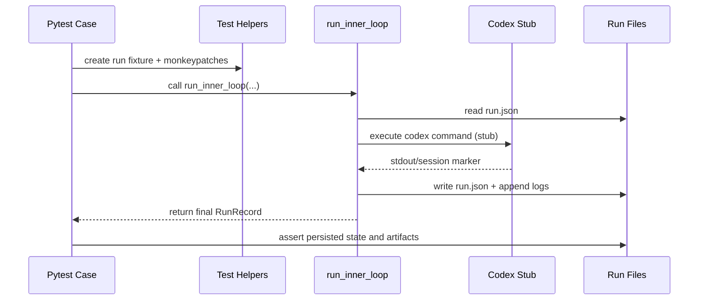

# Inner Loop Unit-Test Wiring Flow

Last updated: 2026-03-03

## Overview

This document describes how `tests/test_inner_loop.py` wires helper fixtures, Codex stubs, and runtime helpers to exercise `loops/core/inner_loop.py` deterministically.

**Related Documents:**
- `docs/flows/ref.inner-loop.md`
- `DESIGN.md`
- `tests/test_cli.py`

## Purpose / Question Answered

How are inner-loop unit tests structured so state transitions, prompt construction, review polling, and reset behavior can be validated without live GitHub/Codex dependencies?

## Entry points

- `pytest tests/test_inner_loop.py`
- `pytest tests/test_cli.py -k inner_loop_reset`

## Call path

### Runtime path

#### Pseudocode (sudocode; test harness wiring)

Source: `tests/test_inner_loop.py`, `loops/core/inner_loop.py`, `loops/core/cli.py`

```ts
function test_case():
  run_dir = tmp_path / "run"
  write baseline run.json fixture
  install stubs/monkeypatches for codex subprocess + gh status polling
  call run_inner_loop(run_dir, runtime overrides)
  assert final run.json state + prompt/log side effects
```

### Stubbed subprocess path

#### Pseudocode (sudocode; codex stub lifecycle)

Source: `tests/test_inner_loop.py:_write_codex_stub`, `loops/core/inner_loop.py:_run_codex_turn`

```ts
function codex_stub(stdin_prompt, argv):
  append stdin_prompt to prompt log
  emit deterministic session_id JSON
  optionally emit push-pr.url artifact on first invocation
  exit 0 or non-zero depending on test scenario
```

### Reset path

#### Pseudocode (sudocode; CLI reset wiring)

Source: `tests/test_cli.py`, `loops/core/cli.py:inner-loop --reset`, `loops/core/inner_loop.py:reset_run_record`

```ts
function reset_test_case():
  seed run_dir with existing run.json (+ optional state_hooks.json)
  invoke CLI: loops inner-loop --run-dir <run_dir> --reset
  assert run.json fields are reset while durable metadata is preserved
  assert state_hooks.json is removed to allow fresh hook execution
```

## State, config, and gates

- Tests exercise derived-state branches (`RUNNING`, `NEEDS_INPUT`, `WAITING_ON_REVIEW`, `PR_APPROVED`, `DONE`) by seeding `run.json` fixtures and controlling `pr_status_fetcher` outputs.
- Codex subprocess behavior is deterministic through local stubs and environment variables (`STUB_COUNTER_PATH`, `STUB_PROMPT_LOG`, `CODEX_CMD`).
- Review and CI gates are unit-tested by monkeypatching `_fetch_pr_status_with_gh_with_context`/`_run_gh_graphql` helpers and asserting transition actions.
- Reset tests validate invariant preservation (task metadata, checkout metadata) and reset-only cleanup (session/input fields, state-hook ledger removal).

## Sequence diagram


