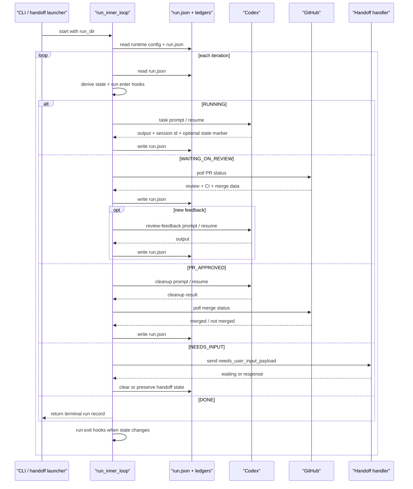

# Inner Loop Flow

Last updated: 2026-03-15

## Purpose / Question Answered

This document explains how Loops executes one run directory inside the inner loop.
It answers three debugging questions: how state is derived from `run.json`, when Codex is invoked or resumed, and what causes the loop to wait, re-enter review handling, or exit as `DONE`.

## Entry points

- `loops/core/cli.py`: `loops inner-loop` resolves `--run-dir` or `LOOPS_RUN_DIR`, then calls `run_inner_loop(...)`.
- `loops/core/cli.py`: `loops handoff [session-id]` creates a run seeded with task and PR context, then launches the configured inner-loop command.
- `loops/core/inner_loop.py`: `run_inner_loop(...)` is the runtime entrypoint for direct callers and tests.

## Call path

```text
+----------------------+
| start or resume run  |
| load runtime snapshot|
+----------------------+
           |
           v
+----------------------+
| read run.json        |
| derive state         |
+----------------------+

  | RUNNING
  v
+----------------------+
| Codex task turn      |
+----------------------+
  | pr found           | needs input
  v                    v
+----------------------+  +----------------------+
| WAITING_ON_REVIEW    |  | NEEDS_INPUT          |
+----------------------+  +----------------------+

---

WAITING_ON_REVIEW
  |
  v
+----------------------+
| poll review and CI   |
+----------------------+
  | approved or        | new feedback        | idle or fail
  | auto_approve       v                     v
  v              +----------------------+  +----------------------+
+----------------+| review Codex turn    |  | NEEDS_INPUT          |
| PR_APPROVED    |+----------------------+  +----------------------+
+----------------+           |
                             v
                       +----------------------+
                       | WAITING_ON_REVIEW    |
                       +----------------------+
---
PR_APPROVED
  |
  v
+----------------------+
| cleanup and poll     |
| merge status         |
+----------------------+
  | merged             | still approved      | idle or fail
  v                    v                     v
+------+      +----------------------+  +----------------------+
| DONE |      | PR_APPROVED          |  | NEEDS_INPUT          |
+------+      +----------------------+  +----------------------+

---
NEEDS_INPUT
  |
  v
+----------------------+
| invoke handoff       |
| handler              |
+----------------------+
  | waiting or         | response
  | terminate          v
  v              +----------------------+
+----------------+| clear needs_input    |
| NEEDS_INPUT    |+----------------------+
+----------------+           |
                             v
                       +----------------------+
                       | read run.json        |
                       | derive state again   |
                       +----------------------+
```

### Phase 1: Startup and state dispatch

Trigger / entry condition:
- A run directory already exists and `run_inner_loop(...)` starts for that directory.

Entrypoints:
- `loops/core/inner_loop.py:run_inner_loop`
- `loops/state/run_record.py:derive_run_state`
- `loops/core/hooks.py:build_default_hook_executor`

Ordered call path:
1. Load run-scoped runtime inputs and persist the effective log-streaming snapshot.
   ```ts
   // Source: loops/core/inner_loop.py (run_inner_loop, _load_runtime_config, _configure_log_streaming)
   runtime_config := _load_runtime_config(run_dir=run_dir, run_log=run_log)
   runtime_env := runtime_config.env if runtime_config is not None else null
   runtime_environ := _apply_runtime_env_overrides(runtime_env)
   runtime_environ := _configure_log_streaming(
     runtime_config=runtime_config,
     environ=runtime_environ,
   )
   runtime_environ["LOOPS_RUN_DIR"] = str(run_dir)
   effective_stream_logs_stdout := should_stream_logs_to_stdout(environ=runtime_environ)

   initial_run_record := read_run_record(run_json_path)
   if initial_run_record.stream_logs_stdout != effective_stream_logs_stdout
     initial_run_record := write_run_record(
       run_json_path,
       replace(initial_run_record, stream_logs_stdout=effective_stream_logs_stdout),
       auto_approve_enabled=auto_approve_enabled,
     )
   ```
2. Build immutable runtime collaborators once for the process.
   ```ts
   // Source: loops/core/inner_loop.py (run_inner_loop)
   base_prompt := _load_prompt_file(...)
   command := _resolve_codex_command(...)
   configured_handoff_handler := _resolve_configured_handoff_handler_name(...)
   auto_approve_enabled := _load_auto_approve_enabled(...)
   task_provider := _resolve_task_provider_for_run(...)
   user_handoff_handler := resolve_builtin_handoff_handler(...) ?? caller override
   runtime := InnerLoopRuntimeContext(
     command=command,
     base_prompt=base_prompt,
     user_handoff_handler=user_handoff_handler,
     pr_status_fetcher=default_or_injected_fetcher,
     auto_approve_enabled=auto_approve_enabled,
     task_provider=task_provider,
     ...
   )
   hook_executor := build_default_hook_executor(run_dir=run_dir, logger=hook_logger)
   control := LoopControlState(backoff_seconds=initial_poll_seconds)
   ```
3. Re-read `run.json` each iteration, derive state, run hooks, dispatch, and stop only on terminal conditions.
   ```ts
   // Source: loops/core/inner_loop.py (run_inner_loop); loops/state/run_record.py (derive_run_state)
   for iteration in range(1, max_iterations + 1)
     run_record := read_run_record(run_json_path)
     state := _derive_state(
       run_record,
       auto_approve_enabled=runtime.auto_approve_enabled,
     )
     hook_executor.execute_on_enter(
       state=state,
       context=TransitionContext(from_state=run_record.last_state, to_state=state, ...),
     )

     if state == "DONE"
       return run_record

     transition := _handle_state(
       state=state,
       run_record=run_record,
       runtime=runtime,
       control=control,
     )
     next_state := _derive_state(transition.run_record, auto_approve_enabled=runtime.auto_approve_enabled)
     if next_state != state
       hook_executor.execute_on_exit(state=state, context=TransitionContext(...))
     if transition.terminate
       return transition.run_record

   return _force_needs_input(
     run_json_path,
     final_record,
     message="Inner loop reached max iterations without DONE. Please provide guidance.",
     auto_approve_enabled=runtime.auto_approve_enabled,
   )
   ```

State transitions / outputs:
- Input: existing run directory, `run.json`, optional `inner_loop_runtime_config.json`, process env.
- Output: one derived state per iteration: `RUNNING`, `WAITING_ON_REVIEW`, `NEEDS_INPUT`, `PR_APPROVED`, or `DONE`.

Branch points:
- Invalid runtime config aborts startup if `inner_loop_runtime_config.json` exists but cannot be parsed.
- `DONE` is derived from persisted state; the loop never trusts model text alone for terminal completion.
- Handoff handler and PR status fetcher can be injected, otherwise built-in defaults are used.

External boundaries:
- Provider status updates through default state hooks.

### Phase 2: `RUNNING` Codex turn

Trigger / entry condition:
- `derive_run_state(...)` returns `RUNNING` because `needs_user_input=false` and `pr is None`.

Entrypoints:
- `loops/core/inner_loop.py:_handle_running_state`
- `loops/core/inner_loop.py:_run_codex_turn`

Ordered call path:
1. Build the normal task prompt and include any deferred human response.
   ```ts
   // Source: loops/core/inner_loop.py (_handle_running_state, _run_codex_turn, _build_prompt)
   updated_record := _run_codex_turn(
     run_json_path=runtime.run_json_path,
     run_log=runtime.run_log,
     agent_log=runtime.agent_log,
     run_record=run_record,
     command=runtime.command,
     environ=runtime.environ,
     base_prompt=runtime.base_prompt,
     user_response=control.next_user_response,
     review_feedback=False,
     auto_approve_enabled=runtime.auto_approve_enabled,
   )

   _build_prompt(
     run_record.task.url,
     runtime.base_prompt,
     user_response=control.next_user_response,
     checkout_mode=run_record.checkout_mode,
     include_checkout_setup_instruction=run_record.codex_session is None,
   )
   ```
2. Invoke Codex, preferring `resume <session_id>` when a prior session exists.
   ```ts
   // Source: loops/core/inner_loop.py (_run_codex_turn, _invoke_codex, _build_codex_turn_command)
   [output, exit_code, resume_fallback_used] := _invoke_codex(
     base_command=command,
     prompt=prompt,
     agent_log=agent_log,
     run_log=run_log,
     codex_session=run_record.codex_session,
     turn_label="codex turn",
     environ=environ,
   )
   session_id := _extract_session_id(output)
   codex_session := session_id ? CodexSession(id=session_id, last_prompt=prompt) : prior_or_null
   ```
3. Persist the turn result, discovering the PR from `push-pr.url` on the first successful task turn.
   ```ts
   // Source: loops/core/inner_loop.py (_run_codex_turn)
   requested_state := _extract_trailing_state_marker(output)
   needs_user_input := exit_code != 0 or requested_state == "NEEDS_INPUT"
   pr := run_record.pr

   if exit_code != 0
     needs_user_input_payload := {
       "message": "Codex exited with a non-zero status. Provide guidance.",
       "context": {"exit_code": exit_code},
     }
   elif not review_feedback and run_record.pr is None
     pr := _extract_pr_from_push_pr_artifact(run_json_path.parent)
     if pr is None
       pr := _extract_pr_from_user_response(user_response)
     if pr is None
       needs_user_input := True
       needs_user_input_payload := {
         "message": "Loops could not determine a PR URL from push-pr.py artifact output. Provide the PR URL or rerun push-pr.py.",
         "context": {"artifact_path": str(run_json_path.parent / PUSH_PR_URL_FILE)},
       }

   return write_run_record(
     run_json_path,
     replace(run_record, pr=pr, codex_session=codex_session, needs_user_input=needs_user_input, needs_user_input_payload=needs_user_input_payload),
     auto_approve_enabled=auto_approve_enabled,
   )
   ```

State transitions / outputs:
- Input: `RunRecord` with no PR, plus any deferred user input from `LoopControlState.next_user_response`.
- Output: updated `run.json` containing refreshed `codex_session`, possible PR metadata, or `needs_user_input=true`.

Branch points:
- First-turn worktree setup instructions are added only when `checkout_mode == "worktree"` and `codex_session is None`.
- A successful Codex exit can still force `NEEDS_INPUT` if Loops cannot discover a PR URL.
- A trailing `<state>NEEDS_INPUT</state>` marker also forces `NEEDS_INPUT`.

External boundaries:
- Codex subprocess invocation.
- Filesystem read of `${LOOPS_RUN_DIR}/push-pr.url`.

### Phase 3: `WAITING_ON_REVIEW` poll and review feedback

Trigger / entry condition:
- `derive_run_state(...)` returns `WAITING_ON_REVIEW` because a PR exists, it is not merged, and it is not yet approved.

Entrypoints:
- `loops/core/inner_loop.py:_handle_waiting_on_review_state`
- `loops/core/inner_loop.py:_fetch_pr_status_with_gh_with_context`
- `loops/core/inner_loop.py:_run_auto_approve_eval`

Ordered call path:
1. Require PR metadata, then poll GitHub through the configured PR status fetcher.
   ```ts
   // Source: loops/core/inner_loop.py (_handle_waiting_on_review_state, _fetch_pr_status_with_gh_with_context)
   if run_record.pr is None
     return _force_needs_input(
       runtime.run_json_path,
       run_record,
       message="Run is waiting on review but no PR metadata exists.",
       auto_approve_enabled=runtime.auto_approve_enabled,
     )

   updated_pr := runtime.pr_status_fetcher(run_record.pr)
   run_record := write_run_record(
     runtime.run_json_path,
     replace(run_record, pr=updated_pr),
     auto_approve_enabled=runtime.auto_approve_enabled,
   )
   ```
2. Resume Codex only for new review or comment feedback.
   ```ts
   // Source: loops/core/inner_loop.py (_handle_waiting_on_review_state, _should_resume_review_feedback, _run_codex_turn)
   if run_record.pr is not None and _should_resume_review_feedback(run_record.pr)
     run_record := _run_codex_turn(
       run_json_path=runtime.run_json_path,
       run_log=runtime.run_log,
       agent_log=runtime.agent_log,
       run_record=run_record,
       command=runtime.command,
       environ=runtime.environ,
       base_prompt=runtime.base_prompt,
       user_response=control.next_user_response,
       review_feedback=True,
       auto_approve_enabled=runtime.auto_approve_enabled,
     )
     control.next_user_response = None
   ```
3. Optionally run one auto-approve evaluation, otherwise back off until the PR changes or idle polling escalates.
   ```ts
   // Source: loops/core/inner_loop.py (_handle_waiting_on_review_state, _run_auto_approve_eval, _increment_idle_polls, _sleep_with_backoff)
   if runtime.auto_approve_enabled and run_record.pr is not None
     if run_record.pr.ci_status == "success" and (run_record.pr.review_status or "open") != "approved"
       verdict := run_record.auto_approve.verdict if run_record.auto_approve is not None else "none"
       if verdict == "none" and not control.auto_approve_attempted
         run_record := _run_auto_approve_eval(run_record=run_record, runtime=runtime, control=control)
         control.auto_approve_attempted = True
         return StateHandlerResult(run_record=run_record, action="auto_approve_eval")

   if _derive_state(run_record, auto_approve_enabled=runtime.auto_approve_enabled) == "WAITING_ON_REVIEW"
     [run_record, control.idle_polls] := _increment_idle_polls(
       run_json_path=runtime.run_json_path,
       run_record=run_record,
       idle_polls=control.idle_polls,
       max_idle_polls=runtime.max_idle_polls,
       message="PR has not changed after repeated polls. Please provide manual guidance.",
       auto_approve_enabled=runtime.auto_approve_enabled,
     )
     _sleep_with_backoff(control=control, runtime=runtime)
   ```

State transitions / outputs:
- Input: `RunPR` from `run.json`, approval settings snapshot, review actor allowlist, optional deferred user response.
- Output: refreshed PR review/CI state, possible review-feedback Codex turn, optional persisted `auto_approve`, or escalation to `NEEDS_INPUT`.

Branch points:
- Missing `pr` is treated as a state/data mismatch and escalates to `NEEDS_INPUT`.
- Review feedback resumes Codex only when `latest_review_submitted_at > review_addressed_at`.
- Auto-approve is only considered when CI is green, review is not already approved, and no verdict has been persisted yet.
- Polling failures and unchanged PR state both count toward idle escalation.

External boundaries:
- `gh pr view ... --json ...` through the default PR status fetcher.
- Optional Codex subprocess invocation for review feedback and auto-approve evaluation.

### Phase 4: `PR_APPROVED` cleanup and merge polling

Trigger / entry condition:
- `derive_run_state(...)` returns `PR_APPROVED` because the PR is approved or auto-approved and not yet merged.

Entrypoints:
- `loops/core/inner_loop.py:_handle_pr_approved_state`
- `loops/core/inner_loop.py:_build_cleanup_prompt`

Ordered call path:
1. Require PR metadata and run cleanup once per PR URL in the current process.
   ```ts
   // Source: loops/core/inner_loop.py (_handle_pr_approved_state, _build_cleanup_prompt)
   if run_record.pr is None
     return _force_needs_input(
       runtime.run_json_path,
       run_record,
       message="Run is PR_APPROVED but no PR metadata exists.",
       auto_approve_enabled=runtime.auto_approve_enabled,
     )

   if control.cleanup_executed_for_pr != run_record.pr.url
     cleanup_prompt := _build_cleanup_prompt(run_record.task.url, runtime.base_prompt)
     [output, exit_code, _resume_fallback_used] := _invoke_codex(
       base_command=runtime.command,
       prompt=cleanup_prompt,
       agent_log=runtime.agent_log,
       run_log=runtime.run_log,
       codex_session=run_record.codex_session,
       turn_label="cleanup turn",
       environ=runtime.environ,
     )
     if exit_code != 0
       return _force_needs_input(... message="Cleanup failed after PR approval. Please advise.", context={"exit_code": exit_code})
     control.cleanup_executed_for_pr = run_record.pr.url
   ```
2. Poll the PR again until merge is visible in persisted PR state.
   ```ts
   // Source: loops/core/inner_loop.py (_handle_pr_approved_state)
   updated_pr := runtime.pr_status_fetcher(run_record.pr)
   run_record := write_run_record(
     runtime.run_json_path,
     replace(run_record, pr=updated_pr),
     auto_approve_enabled=runtime.auto_approve_enabled,
   )
   ```
3. Keep polling while the derived state remains waiting, otherwise return immediately.
   ```ts
   // Source: loops/core/inner_loop.py (_handle_pr_approved_state, _increment_idle_polls, _sleep_with_backoff)
   if _derive_state(run_record, auto_approve_enabled=runtime.auto_approve_enabled) == "PR_APPROVED"
     [run_record, control.idle_polls] := _increment_idle_polls(
       run_json_path=runtime.run_json_path,
       run_record=run_record,
       idle_polls=control.idle_polls,
       max_idle_polls=runtime.max_idle_polls,
       message="PR is still approved but not merged after repeated polls. Please provide manual guidance.",
       auto_approve_enabled=runtime.auto_approve_enabled,
     )

   next_state := _derive_state(run_record, auto_approve_enabled=runtime.auto_approve_enabled)
   if next_state not in WAITING_STATES
     return StateHandlerResult(run_record=run_record, action="approved_poll")
   _sleep_with_backoff(control=control, runtime=runtime)
   ```

State transitions / outputs:
- Input: approved PR plus existing Codex session.
- Output: cleanup side effects, refreshed PR metadata, eventual `DONE` when `pr.merged_at` is persisted.

Branch points:
- Cleanup failure escalates to `NEEDS_INPUT`.
- Merge polling failure or repeated non-progress also escalates to `NEEDS_INPUT`.
- Cleanup is tracked only in `LoopControlState`, so a new process may re-run cleanup for the same PR URL.

External boundaries:
- Codex subprocess invocation for cleanup.
- GitHub polling through `runtime.pr_status_fetcher`.

### Phase 5: `NEEDS_INPUT` handoff and resume

Trigger / entry condition:
- `derive_run_state(...)` returns `NEEDS_INPUT` because `run_record.needs_user_input == true`.

Entrypoints:
- `loops/core/inner_loop.py:_handle_needs_input_state`
- `loops/core/inner_loop.py:_handle_needs_input`
- `loops/core/handoff_handlers.py:resolve_builtin_handoff_handler`

Ordered call path:
1. Invoke the configured handoff handler with the persisted payload from `run.json`.
   ```ts
   // Source: loops/core/inner_loop.py (_handle_needs_input_state, _handle_needs_input)
   response := _handle_needs_input(
     run_record,
     runtime.user_handoff_handler,
     runtime.run_log,
   )

   payload := run_record.needs_user_input_payload ?? {
     "message": "Input required to continue.",
   }
   raw_result := handler(payload)
   handoff_result := _normalize_handoff_result(raw_result)
   ```
2. If no response is ready, either keep waiting or terminate early in non-interactive stdin mode.
   ```ts
   // Source: loops/core/inner_loop.py (_handle_needs_input_state)
   if response is None
     if runtime.non_interactive_default_handoff
       terminal_record := read_run_record(runtime.run_json_path)
       return StateHandlerResult(
         run_record=terminal_record,
         action="needs_input_non_interactive_exit",
         terminate=True,
       )
     _sleep_with_backoff(control=control, runtime=runtime)
     return StateHandlerResult(run_record=run_record, action="needs_input_waiting")
   ```
3. Clear the persisted handoff request and carry the user response into the next Codex-capable state.
   ```ts
   // Source: loops/core/inner_loop.py (_handle_needs_input_state)
   control.next_user_response = response
   cleared_record := write_run_record(
     runtime.run_json_path,
     replace(
       run_record,
       needs_user_input=False,
       needs_user_input_payload=None,
     ),
     auto_approve_enabled=runtime.auto_approve_enabled,
   )
   return StateHandlerResult(run_record=cleared_record, action="needs_input_cleared")
   ```

State transitions / outputs:
- Input: persisted handoff request in `run.json`.
- Output: either continued waiting, early process exit, or a cleared run record plus `control.next_user_response`.

Branch points:
- `stdin_handler` reads from the terminal; `gh_comment_handler` posts a prompt comment and waits for `/loops-reply`.
- Empty, invalid, or exception-raising handoff results are treated as `waiting`.
- Clearing `needs_user_input` does not force `RUNNING`; the next derived state depends on whether a PR already exists.

External boundaries:
- Terminal stdin for `stdin_handler`.
- GitHub issue comments for `gh_comment_handler`.

## State, config, and gates

### Core state values (source of truth and usage)

- `run.json`
  - Source: `write_run_record(...)` in the inner loop and initial materialization by the outer loop.
  - Consumed by: `read_run_record(...)` at startup and at the top of every iteration.
  - Risk area: state is always reloaded from disk, so stale in-memory assumptions are intentionally discarded each iteration.

- `InnerLoopRuntimeConfig`
  - Source: `inner_loop_runtime_config.json` written before launch by the outer loop.
  - Consumed by: `_load_runtime_config(...)` once at process start.
  - Risk area: runtime config is snapshotted once per process; later file edits do not affect a running inner loop.

- `LoopControlState.next_user_response`
  - Source: `_handle_needs_input_state(...)` after a successful handoff response.
  - Consumed by: `_handle_running_state(...)` and review-feedback `_run_codex_turn(...)`.
  - Risk area: this value is in-memory only, so it must be consumed before process exit.

- `state_hooks.json`
  - Source: `HookExecutor` in `loops/core/hooks.py`.
  - Consumed by: `execute_on_enter(...)` and `execute_on_exit(...)` to dedupe hook side effects across retries.
  - Risk area: `loops inner-loop --reset` deletes the hook ledger so deterministic enter hooks can run again.

- `handoff_gh_comment_state.json`
  - Source: `GHCommentHandoffHandler`.
  - Consumed by: repeated `gh_comment_handler` polling during `NEEDS_INPUT`.
  - Risk area: this file prevents duplicate prompt comments and re-consuming old `/loops-reply` comments.

Ordering check:
- Yes. Runtime-config values are initialized before `InnerLoopRuntimeContext` is built, and run-state values are re-read from `run.json` before each handler consumes them.

### Statsig (or `None identified`)

None identified.

### Environment Variables (or `None identified`)

| Name | Where Read | Default | Effect on Flow |
|---|---|---|---|
| `LOOPS_RUN_DIR` | `loops/core/cli.py`, then forced again in `loops/core/inner_loop.py` | required when `--run-dir` is omitted | Selects the run directory and guarantees Codex subprocesses receive the same run context. |
| `CODEX_CMD` | `loops/core/inner_loop.py:_resolve_codex_command` | `codex exec --yolo` | Controls how task turns, review turns, auto-approve evaluation, and cleanup are invoked. |
| `LOOPS_PROMPT_FILE` / `CODEX_PROMPT_FILE` | `loops/core/inner_loop.py:_load_prompt_file` | unset | Supplies an optional base prompt prepended to all inner-loop prompts. |
| `LOOPS_HANDOFF_HANDLER` | `loops/core/inner_loop.py:_resolve_configured_handoff_handler_name` | `stdin_handler` | Selects the built-in handoff strategy when runtime config does not provide one. |
| `LOOPS_AUTO_APPROVE_ENABLED` | `loops/core/inner_loop.py:_load_auto_approve_enabled` | `false` | Enables the extra `WAITING_ON_REVIEW -> PR_APPROVED` path based on persisted `auto_approve.verdict == APPROVE`. |
| `LOOPS_STREAM_LOGS_STDOUT` | `loops/core/inner_loop.py:_configure_log_streaming`, `loops/utils/logging.py` | unset | Mirrors `run.log` lines to stdout when enabled. |
| `GITHUB_TOKEN` / `GH_TOKEN` | inherited by `gh` subprocesses in review and handoff code | environment-dependent | Determines whether GitHub review polling and comment-based handoff can talk to GitHub successfully. |

### Other User-Settable Inputs (or `None identified`)

| Name | Type | Where Read | Effect on Flow |
|---|---|---|---|
| `--run-dir` | CLI option | `loops/core/cli.py` | Overrides `LOOPS_RUN_DIR` for the target run. |
| `--prompt-file` | CLI option | `loops/core/cli.py`, then `loops/core/inner_loop.py:_load_prompt_file` | Overrides env-based prompt selection for the current invocation. |
| `loop_config.handoff_handler` | config field written by outer loop | `inner_loop_runtime_config.json` -> `_resolve_configured_handoff_handler_name(...)` | Chooses `stdin_handler` vs `gh_comment_handler`. |
| `loop_config.auto_approve_enabled` | config field written by outer loop | `inner_loop_runtime_config.json` -> `_load_auto_approve_enabled(...)` | Enables auto-approve evaluation after successful CI. |
| `task_provider_config.approval_comment_usernames` / `approval_comment_pattern` | provider config fields | `inner_loop_runtime_config.json` -> `_load_comment_approval_settings(...)` | Allow matching PR comments or review bodies to count as approval signals. |
| `task_provider_config.allowlist` | provider config field | `inner_loop_runtime_config.json` -> `_load_comment_approval_settings(...)` | Filters review/comment actors considered during PR polling. |
| `run.json.pr`, `run.json.needs_user_input`, `run.json.auto_approve`, `run.json.checkout_mode` | persisted run state | `loops/state/run_record.py`, `loops/core/inner_loop.py` | Determines state derivation, prompt shape, and whether the loop waits, polls, cleans up, or exits. |
| `run_inner_loop(...)` parameters | function arguments | `loops/core/inner_loop.py` | Set max iterations, poll cadence, and idle escalation thresholds. |

### Important gates / branch controls

- `derive_run_state(...)`: prioritizes `NEEDS_INPUT`, then `DONE`, then `RUNNING`, then `PR_APPROVED`, otherwise `WAITING_ON_REVIEW`.
- `_should_resume_review_feedback(pr)`: resumes Codex only for new review or comment feedback.
- `approval_timestamp > latest_changes_requested_at`: prevents stale approval comments or review bodies from overriding newer requested changes.
- `pr.ci_status == "success"` plus `auto_approve.verdict == "APPROVE"`: enables the auto-approve promotion path into `PR_APPROVED`.
- `control.cleanup_executed_for_pr != run_record.pr.url`: runs cleanup once per PR URL per process.
- `_increment_idle_polls(...)`: converts long periods of no progress into `NEEDS_INPUT`.

## Sequence diagram



## Observability

Metrics:
- None identified as dedicated metrics. The practical counters come from `run.log` iteration lines, polling failures, and persisted `run.json` state.

Logs:
- Iteration enter/exit logs include state, action, PR status, CI status, and idle/backoff values.
- Codex output is appended to both `agent.log` and `run.log`.
- Review polling logs record allowlist behavior, approval-comment handling, and `gh` failures.
- Hook execution logs are prefixed with `[loops][hooks]`.

Useful debug checkpoints:
- `run.json`: current authoritative state and timestamps.
- `state_hooks.json`: whether enter/exit hooks already fired for this run.
- `handoff_gh_comment_state.json`: current GitHub-comment handoff cursor.
- `push-pr.url`: deterministic PR discovery artifact for the first successful task turn.

## Related docs

- `DESIGN.md`
- `docs/flows/ref.outer-loop.md`
- `docs/flows/ref.pr-status-fetcher.md`
- `docs/specs/2026-02-09-manage-inner-loop-state-machine.md`

## Manual Notes 

[keep this for the user to add notes. do not change between edits]

## Changelog
- 2026-03-15: Simplified the inner-loop flow doc into the current phase-based template and re-verified state ordering, handlers, hooks, and handoff behavior against current code. (019cf3e3-b2c2-7e12-b2cd-cf186f3b4db3)
