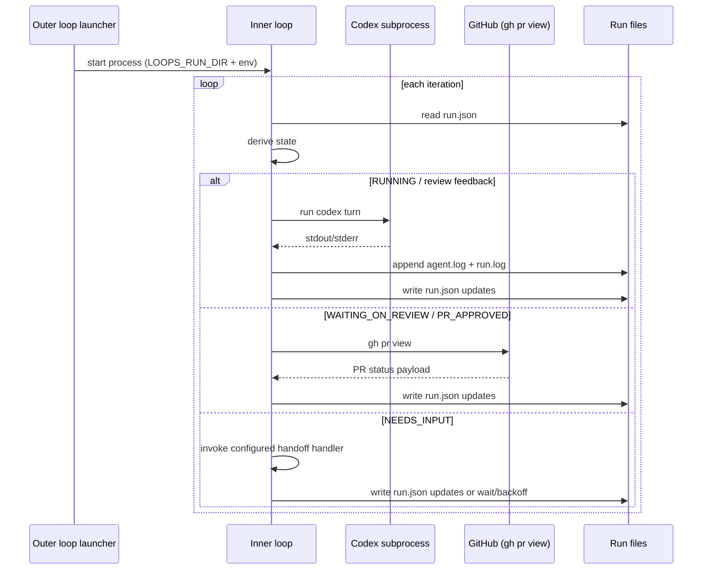

# Inner Loop Flow

Last updated: 2026-03-05

## Overview

This document describes how Loops executes a single task run in the inner loop, including state derivation, Codex turns, review polling, user handoff, and completion semantics.
It is intended as a fast context-recapture artifact for humans and LLM agents changing `loops/core/inner_loop.py` behavior.

**Related Documents:**
- `DESIGN.md`
- `README.md`
- `LAYOUT.md`
- `docs/specs/2026-02-09-manage-inner-loop-state-machine.md`
- `docs/specs/.archive/2026-02-09-implement-inner-loop-runner.md`

## Terminology

- `Run directory`: Per-task folder under `.loops/jobs/<run>/` containing `run.json`, `run.log`, and `agent.log`.
- `Run record`: The `RunRecord` payload persisted in `run.json`.
- `Derived state`: `RUNNING | WAITING_ON_REVIEW | NEEDS_INPUT | PR_APPROVED | DONE`, computed from `pr` + `needs_user_input`.
- `Auto-approve gate`: inline branch inside `WAITING_ON_REVIEW` that applies only when review is not already approved, CI is green, and `auto_approve_enabled` is true; it runs one-time `$ag-judge` evaluation.
- `Single-writer model`: Inner loop is the only writer of `run.json`.

## Purpose / Question Answered

How does the inner loop execute a single run directory end-to-end, derive state transitions, and coordinate Codex/review/handoff work while preserving single-writer ownership of `run.json`?

## Entry points

- CLI command `loops inner-loop` resolves run directory and calls `run_inner_loop(...)` (`loops/core/cli.py`).
- Outer-loop launched process invokes the same inner-loop command with `LOOPS_RUN_DIR`; run-scoped settings are loaded from `inner_loop_runtime_config.json` (`loops/core/outer_loop.py` + `loops/core/inner_loop.py`).
- `loops handoff [session-id]` seeds a new run in `WAITING_ON_REVIEW` from Codex conversation context (tracking task + PR) and then launches the configured inner-loop command.

## Call path

### Runtime path

#### Pseudocode (sudocode; inner-loop state machine)

Source: `loops/core/inner_loop.py`, `loops/state/run_record.py`, `loops/utils/logging.py`

```ts
function run_inner_loop(run_dir):
  load run.json + defaults + approval settings
  resolve handoff handler and codex command

  while iteration <= max_iterations:
    run_record = read_run_record(run_json)
    state = derive_run_state(run_record.pr, run_record.needs_user_input)
    hook_ctx = transition_context(run_id, from_state=run_record.last_state, to_state=state)
    execute_on_enter_hooks(state, hook_ctx)

    if state == DONE:
      return run_record
    transition = dispatch_state_handler(state, run_record, runtime, control)
    next_state = derive_next_state(transition.run_record)
    if next_state != state:
      execute_on_exit_hooks(state, transition_context(run_id, from_state=state, to_state=next_state))
    // handlers:
    // - handle_needs_input_state
    // - handle_running_state
    // - handle_waiting_on_review_state
    // - handle_pr_approved_state
    if transition.terminate:
      return transition.run_record

  force NEEDS_INPUT and return
```

## State, config, and gates

- Core state is derived each iteration from `run.json` (`pr`, `needs_user_input`), not from cached in-memory state.
- Transition gates include: review freshness (`latest_review_submitted_at > review_addressed_at`), idle polling threshold escalation, and max-iteration fallback.
- State hooks run around iteration dispatch boundaries: `on_enter` runs before the state handler, and `on_exit` runs only when the next derived state differs from the current state. Hook dedupe key remains `${run_id}:${phase}:${state}:${hook_id}` and is persisted in `state_hooks.json`.
- Default state hooks apply deterministic provider status transitions: enter `RUNNING` -> `IN_PROGRESS`, enter `DONE` -> `DONE`.
- Additional inline review gate: when review is not already approved and `ci_status == success`, if `auto_approve_enabled` is true and `RunRecord.auto_approve` is unset/`none`, run one-time `$ag-judge` and persist judgement on `RunRecord`.
- Runtime config comes from CLI options plus run-scoped `inner_loop_runtime_config.json`; env fallbacks are limited to designated runtime keys (`CODEX_CMD`, `LOOPS_PROMPT_FILE`/`CODEX_PROMPT_FILE`, `LOOPS_HANDOFF_HANDLER`, `LOOPS_AUTO_APPROVE_ENABLED`, `LOOPS_STREAM_LOGS_STDOUT`) when runtime config is absent or omits them. `stream_logs_stdout` in `inner_loop_runtime_config.json` controls `run.log` stdout mirroring, and malformed runtime config is treated as a startup error.
- Provider resolution for deterministic state hooks validates required secrets against the run's effective runtime environment (runtime-config env overrides merged over process env), not only the parent process environment.
- `loops inner-loop --reset` removes run-local `state_hooks.json` so hook dedupe state does not suppress deterministic state transitions on a fresh retry in the same run directory.
- In sync-mode launches, outer loop writes `stream_logs_stdout=true` in `inner_loop_runtime_config.json`, which causes inner-loop `run.log` appends to be mirrored to stdout.
- Initial Codex prompt setup now reads `RunRecord.checkout_mode`; when mode is `worktree`, the first RUNNING turn adds explicit instructions to create/switch to a task worktree before edits.

## Sequence diagram



## Config

### Statsig

None identified.

### Environment Variables

| Name | Where Read | Default | Effect on Flow |
|---|---|---|---|
| `LOOPS_RUN_DIR` | `loops/core/inner_loop.py:973`, `loops/core/cli.py:223` | Required when `--run-dir` is omitted | Selects the run directory that provides `run.json` and runtime logs. |
| `CODEX_CMD` | `loops/core/inner_loop.py` command resolver fallback | `codex exec --yolo` | Fallback base Codex command when runtime config env payload does not provide `CODEX_CMD` (or runtime config is unavailable). |
| `LOOPS_PROMPT_FILE` | `loops/core/inner_loop.py` prompt resolver fallback | unset | Fallback prompt file when runtime config env payload does not provide one (or runtime config is unavailable). |
| `CODEX_PROMPT_FILE` | `loops/core/inner_loop.py` prompt resolver fallback | unset | Secondary fallback prompt file. |
| `LOOPS_HANDOFF_HANDLER` | `loops/core/inner_loop.py` handoff resolver fallback | `stdin_handler` | Direct/manual-run fallback built-in NEEDS_INPUT handoff strategy. |
| `LOOPS_STREAM_LOGS_STDOUT` | `loops/utils/logging.py` | unset | When set to truthy values (for example `1`), inner-loop `run.log` writes are mirrored to stdout. |
| `GITHUB_TOKEN` / `GH_TOKEN` | Read by `gh` subprocess invoked from `loops/core/inner_loop.py:767` | environment-dependent | Determines whether PR status polling via `gh pr view` succeeds in review/merge polling states. |

### Other User-Settable Inputs

| Name | Type | Where Read | Effect on Flow |
|---|---|---|---|
| `--run-dir` | CLI option | `loops/core/cli.py:77`, `loops/core/inner_loop.py:982` | Overrides `LOOPS_RUN_DIR` for the target run. |
| `--prompt-file` | CLI option | `loops/core/cli.py:84`, `loops/core/inner_loop.py:489` | Overrides prompt-file env fallbacks and changes all Codex prompts for the run. |
| `task_provider_config.approval_comment_usernames` / `task_provider_config.approval_comment_pattern` | Config file fields (provider) | validated in provider model, then resolved by `loops/core/outer_loop.py` and written to `inner_loop_runtime_config.json` | Controls comment-based approval override behavior in review polling. |
| `task_provider_config.allowlist` (GitHub provider) | Config file field (outer loop/provider) | `loops/core/cli.py` + `loops/core/outer_loop.py` -> resolved and written to `inner_loop_runtime_config.json` as `review_actor_usernames` | Filters review-phase PR comments/reviews to allowlisted actors during polling. |
| `loop_config.handoff_handler`, `loop_config.auto_approve_enabled`, `loop_config.sync_mode`, `inner_loop.env` | Config file fields (outer loop) | `loops/core/outer_loop.py` -> written to `inner_loop_runtime_config.json` | Controls runtime handoff strategy, auto-approve gate, log mirroring, and optional run-scoped env payload for inner-loop subprocess behavior. |
| `run.json` content (`pr`, `needs_user_input`, `needs_user_input_payload`, `stream_logs_stdout`, `checkout_mode`, `starting_commit`) | Persisted state | `loops/state/run_record.py` | Determines state-machine branch selection, exposes effective log-streaming mode, and carries checkout guidance for initial prompt construction. |
| `run_inner_loop(...)` polling params | Function args | `loops/core/inner_loop.py:58` | Controls max iterations, poll backoff, and idle escalation thresholds. |

## Flow

### Entry assumptions and boundaries

- Outer loop (or `loops handoff`) has created the run directory and initial `run.json`.
- CLI or module entry resolves run dir and calls `run_inner_loop` (`loops/core/cli.py:90`, `loops/core/inner_loop.py:982`).
- Inner loop owns future `run.json` mutations through `write_run_record` (`loops/state/run_record.py:206`).

### State Timeline Table

| value | write step | snapshot step | read step | ordering valid? |
|---|---|---|---|---|
| comment-approval settings (`usernames`, `pattern`) plus review-actor allowlist (`review_actor_usernames`) | Written by outer loop to `inner_loop_runtime_config.json` | Loaded once at run start before default PR poller closure creation | Used on each `WAITING_ON_REVIEW` poll to evaluate comment-based approval and review-feedback filtering | Yes |
| runtime settings (`handoff_handler`, `auto_approve_enabled`, `stream_logs_stdout`, optional `env`) | Written by outer loop launcher to `inner_loop_runtime_config.json` | Loaded once at run start before handoff/codex resolution | Used to configure handoff behavior, auto-approve gate, and optional runtime env overrides | Yes |
| `run_record.stream_logs_stdout` | Written to `run.json` on run creation/reset and at inner-loop startup when effective value changes | Reloaded each iteration with `run.json` | Provides a durable snapshot of effective `run.log` stdout mirroring for diagnostics | Yes |
| `needs_user_input` | Written in `_run_codex_turn` and `_force_needs_input` (`loops/core/inner_loop.py`) | Reloaded at top of each iteration (`loops/core/inner_loop.py`) | Used by `derive_run_state` (`loops/state/run_record.py`) | Yes |
| `pr.review_status` | Updated from Codex output or PR poll (`loops/core/inner_loop.py:635`, `loops/core/inner_loop.py:259`, `loops/core/inner_loop.py:392`) | Reloaded each iteration (`loops/core/inner_loop.py:87`) | Branches into `WAITING_ON_REVIEW`/`PR_APPROVED` (`loops/core/inner_loop.py:208`, `loops/core/inner_loop.py:325`) | Yes |
| `pr` (initial `url/number/repo` plus review fields) | Initial PR link is read from `${LOOPS_RUN_DIR}/push-pr.url` after successful `RUNNING` codex turn only when `run.json.pr` is missing; review fields are updated by PR polling | Reloaded each iteration (`loops/core/inner_loop.py:87`) | Branches into `WAITING_ON_REVIEW`/`PR_APPROVED` and drives merge polling | Yes |
| `pr.merged_at` | Written by PR status poll (`loops/core/inner_loop.py:767`, persisted at `loops/core/inner_loop.py:392`) | Reloaded each iteration (`loops/core/inner_loop.py:87`) | Triggers `DONE` via `derive_run_state` (`loops/state/run_record.py:142`) | Yes |
| `pr.latest_review_submitted_at` and `pr.review_addressed_at` | Written in gh fetch + review-feedback codex completion (`loops/core/inner_loop.py:767`, `loops/core/inner_loop.py:659`) | Reloaded each iteration (`loops/core/inner_loop.py:87`) | Checked by `_is_new_review` gate (`loops/core/inner_loop.py:727`) | Yes |
| `codex_session.id` | Extracted and persisted after Codex turn (`loops/core/inner_loop.py`) | Reloaded each iteration (`loops/core/inner_loop.py:87`) | Drives `codex exec resume <session_id>` for follow-up turns and remains durable session metadata | Yes |
| `state_hooks.json` executed keys | Written by hook executor after successful hook callbacks | Reloaded at inner-loop start and consulted on each hook execution | Prevents duplicate hook execution during retries/restarts | Yes |
| `handoff_gh_comment_state.json` | Written by `gh_comment_handler` after prompt/reply detection | Reloaded on each NEEDS_INPUT iteration when handler is `gh_comment_handler` | Enforces idempotent prompt posting and reply de-duplication | Yes |

### Inner loop state-machine execution

- `loops/core/inner_loop.py:52` (main orchestrator)
```ts
function runInnerLoop(runDir: Path, opts: Options): RunRecord {
  initializePathsAndDefaults(runDir, opts)
  commentApproval = loadCommentApprovalSettings(runtimeConfig) // reads approval fields from inner_loop_runtime_config.json
  if (commentApproval.usedDefaultPattern) {
    log("[loops] invalid approval comment pattern in run runtime config; falling back to default")
  }
  if (prStatusFetcher is null) {
    prStatusFetcher = (pr) => {
      [updatedPr, approvedByComment, approver] = pollPrWithGhAndContext(pr, commentApproval)
      if (approvedByComment) {
        log(`[loops] treating PR as approved via allowlisted approval signal by ${approver}`)
      }
      return updatedPr
    }
  }

  for (iteration = 1; iteration <= maxIterations; iteration++) {
    record = readRunRecord(runJsonPath)
    state = deriveRunState(record.pr, record.needsUserInput)
    logIterationEnter(iteration, state, record, backoff, idlePolls)

    if (state === "DONE") {
      logDoneAndExit(iteration, record)
      return record
    }

    transition = handleState(state, record, runtime, control)
    logIterationExit(iteration, transition.action, transition.record, control)
    if (transition.terminate) {
      return transition.record
    }
  }

  return forceNeedsInput("Inner loop reached max iterations without DONE. Please provide guidance.")
}
```

### Supporting control paths

- Codex turn behavior (`loops/core/inner_loop.py:601`):
  - Base prompt contract requires using `$dev.loop` to implement the task and open/update the PR.
  - Builds prompt (standard vs review-feedback path).
  - On the first RUNNING turn, if `run_record.checkout_mode == worktree`, prepends worktree setup instructions to the prompt.
  - Base prompt contract says Codex may wait for the `a-review` subagent but must not wait for human PR comments/reviews because the outer harness performs comment monitoring and re-invokes Codex when needed.
  - Base prompt contract requires posting `a-review` output to PR comments whenever `a-review` runs, including explicit no-findings comments.
  - Base prompt contract explicitly forbids using the `gen-notifier` skill while running inside loops.
  - Base prompt contract explicitly forbids direct issue/project task-status mutations because the harness now applies deterministic state-transition hooks.
  - Base prompt contract requires explicit initial PR sequence while state is `RUNNING`: invoke:commit-code (if needed), run `scripts/push-pr.py`, then invoke:check-ci and invoke:fix-pr on failures.
  - Selects invocation strategy (new session vs `resume <session_id>`) from `run_record.codex_session`.
  - Streams stdout/stderr into `agent.log` and appends the same output to `run.log`.
  - Extracts session id and trailing `<state>...</state>` marker from output when the final line is marker-only (legacy `</>` close tag is also accepted for compatibility).
  - For initial `RUNNING` turns (no PR yet), reads deterministic PR artifact `${LOOPS_RUN_DIR}/push-pr.url` instead of parsing PR URLs from Codex stdout.
  - If artifact discovery fails on initial `RUNNING` turns, can recover from a PR URL present in handoff `user_response`; otherwise sets `needs_user_input=true` with artifact-path context.
  - Sets `needs_user_input=true` on non-zero exits or on trailing `NEEDS_INPUT` state markers.

- Review polling behavior (`loops/core/inner_loop.py:767`):
  - Loads comment-approval settings once per run from `inner_loop_runtime_config.json` and compiles approval pattern with safe fallback.
  - When provider review-actor allowlist is configured, filters `latestReviews`, `reviews`, and `comments` to allowlisted actors before deriving review status/feedback.
  - Calls `gh pr view ... --json reviewDecision,mergedAt,url,number,latestReviews,reviews,comments`.
  - Maps decision into `review_status`, captures latest relevant review timestamp, and may override to approved when the newest allowlisted approval signal (plain PR comment or `COMMENTED`/`APPROVED` review body matching pattern) is newer than latest `CHANGES_REQUESTED` review.
  - When the winning approval signal is a plain PR comment, performs a best-effort idempotent 👍 reaction on that comment node through `gh api graphql addReaction`; reaction failures are logged and do not block state progression.
  - When review status remains open, chooses the newest timestamp between the latest `COMMENTED` PR review and plain PR discussion comment and uses that as the feedback signal.
  - When review is approved, the loop derives `PR_APPROVED` via the existing manual path.
  - If review is not already approved, CI is green, and `auto_approve_enabled` is true with no stored verdict, it runs one-time `trigger:auto-approve-eval` (`$ag-judge`, fixed judge book `references/jb.coding.md`) and persists verdict/scores on `RunRecord.auto_approve`.
  - Auto-approve prompt contract requires posting `ag-judge` verdict plus impact/risk/size scores to PR comments, alongside the machine-parseable JSON response.
  - Only `auto_approve.verdict == APPROVE` allows promotion to `PR_APPROVED`; `REJECT`/`ESCALATE` remain blocked in `WAITING_ON_REVIEW` with no automatic re-run.

- Approved-state merge polling behavior (`loops/core/inner_loop.py`):
  - Runs cleanup once per PR URL, then polls merge status.
  - Uses the same idle-poll threshold gate as review polling: repeated poll errors or no merge progress force `NEEDS_INPUT` with manual guidance.

- Signal consumption behavior (`loops/core/inner_loop.py:941`):
  - Reads unread JSONL entries from queue offset.
  - Applies `NEEDS_INPUT` payloads to run record.
  - Advances offset only after successful record write.

- Handoff behavior (`loops/core/inner_loop.py`, `loops/core/handoff_handlers.py`):
  - Resolves built-in handler from run-scoped `inner_loop_runtime_config.json` when present, otherwise from `LOOPS_HANDOFF_HANDLER` fallback (`stdin_handler` default).
  - `stdin_handler` prompts in terminal.
  - `gh_comment_handler` requires `task.provider_id=github_projects_v2`, parses `task.url` as issue URL, posts prompt comment, and waits for explicit `/loops-reply ...` comments.
  - Persists `handoff_gh_comment_state.json` to avoid duplicate prompt comments across retries.

### Exit/handoff contracts

- Inner loop exits normally only when derived state is `DONE` (`loops/core/inner_loop.py:99`).
- It can return early in non-interactive `NEEDS_INPUT` mode to hand control back to caller (`loops/core/inner_loop.py:119`).
- It escalates to `NEEDS_INPUT` on repeated polling idleness (both review and approved states) or iteration cap (`loops/core/inner_loop.py:233`, `loops/core/inner_loop.py:409`).

**File(s)**: `loops/core/inner_loop.py`, `loops/state/run_record.py`, `loops/core/outer_loop.py`, `loops/core/cli.py`

## Architecture Diagram

```text
+------------------+
| outer_loop       |
| launcher         |
| sets env + run   |
+---------+--------+
          |
          v
+---------------------------------------------------------------+
| inner_loop.run_inner_loop                                     |
| - read run.json                                                |
| - derive state                                                 |
| - dispatch to state handler                                    |
|   (running/review/input/approved)                              |
+---------------------+-------------------------+---------------+
                      |                         |
                      v                         v
             +------------------+      +-----------------------+
             | Codex subprocess |      | gh pr view polling    |
             | writes agent.log |      | updates PR state      |
             +--------+---------+      +-----------+-----------+
                      |                            |
                      +------------+---------------+
                                   v
                         +--------------------+
                         | write run.json     |
                         | (single writer)    |
                         +--------------------+
```

## Metrics

No dedicated metrics emitter is implemented in code today.

Useful derived metrics from logs/files:

- Iterations per run (count `iteration ... enter` in `run.log`).
- Codex failures (count `codex exit code` log entries).
- Review polling instability (count `failed to poll PR status` / `failed to poll merge status`).
- NEEDS_INPUT handoffs (count transitions where `needs_user_input` is true in `run.json`).
- Time-to-done (first and last timestamps around run lifecycle in `run.log` + `run.json.updated_at`).

## Logs

Key logs and emit sites:

- Iteration entry/exit with state/action context: `loops/core/inner_loop.py:428`, `loops/core/inner_loop.py:447`.
- Non-interactive handoff exit: `loops/core/inner_loop.py:120`.
- Codex invocation or exit failures: `loops/core/inner_loop.py:567`, `loops/core/inner_loop.py:642`.
- Missing PR after successful turn: `loops/core/inner_loop.py:655`.
- Review/merge polling failures: `loops/core/inner_loop.py:231`, `loops/core/inner_loop.py:375`.
- Agent streamed output destination: `agent.log` (also mirrored to `run.log`).
- In sync mode (via `inner_loop_runtime_config.json` with `stream_logs_stdout=true`), each `run.log` line is also emitted to stdout.

## FAQ

Q: Why can a successful Codex turn still transition to `NEEDS_INPUT`?
A: In initial `RUNNING` turns where `run.json.pr` is still missing, if `${LOOPS_RUN_DIR}/push-pr.url` is missing/invalid and user input does not include a usable PR URL, the loop requests manual guidance.

Q: Why does review feedback not always re-trigger Codex?
A: The loop resumes Codex only for new feedback events (`latest_review_submitted_at > review_addressed_at`): new `changes_requested` reviews, or new open-state feedback where the newest timestamp between `COMMENTED` PR review events and plain PR discussion comments has advanced. Duplicate events with unchanged timestamps are skipped.

Q: Should Codex ever wait for human PR comments/reviews inside a turn?
A: No. Prompt contract tells Codex to end the turn after handling current feedback; the harness performs polling/comment monitoring and re-invokes Codex when new feedback appears. The only allowed wait inside a turn is for the critical `a-review` subagent.

Q: When does inner loop reuse the same Codex session?
A: After the first successful turn stores `codex_session.id`, follow-up turns (review-feedback turns and PR-approved cleanup turns) attempt `codex exec resume <session_id>`; if the resolved base command is not codex-shaped, the loop logs fallback and runs the base command.

Q: Can a PR move to `PR_APPROVED` without `reviewDecision=APPROVED`?
A: Yes. There are two supported paths: (1) manual approval signals (including allowlisted matching approval text newer than latest `CHANGES_REQUESTED` review), and (2) when review is not already approved, CI is green, `auto_approve_enabled=true`, and the one-time auto-approve verdict is `APPROVE`.

Q: How does `gh_comment_handler` know which comment to consume?
A: It only accepts comments that start with `/loops-reply` and are newer than the current prompt comment, tracked with run-local handoff state.

Q: Where is auto-approve judgement persisted?
A: On top-level `RunRecord.auto_approve`, not under `RunPR`. The gate runs once per conversation when review is not already approved and CI is green.

Q: Who owns `run.json` updates?
A: Inner loop only.

## Manual Notes 

[keep this for the user to add notes. do not change between edits]

## Changelog
- 2026-03-05: Added `loops handoff [session-id]` as an inner-loop entry path that seeds `WAITING_ON_REVIEW` runs from Codex conversation-derived PR/task context. (019cbc25-7679-72f2-9fa9-1a6dbf122fca)
- 2026-03-03: Added deterministic state-hook lifecycle semantics (`on_enter`/`on_exit`), provider-backed task-status transitions, and hook-ledger (`state_hooks.json`) dedupe details. (019cb477-2e59-7311-add3-9b2f19720d5e)
- 2026-03-02: Documented run-record checkout metadata (`checkout_mode`, `starting_commit`) and worktree setup instruction injection on initial RUNNING prompts. (019cabf2-f02b-7521-b814-5b0fcafe3d34)
- 2026-03-02: Removed legacy `inner_loop_approval_config.json` fallback; comment-approval settings now load only from `inner_loop_runtime_config.json`. (019cabe9-52d6-73a2-b856-da28851da5b5)
- 2026-03-01: Removed state-signal queue references after deleting `loops signal`/`loops.state_signal`; NEEDS_INPUT now documents direct `run.json` handoff behavior. (019cabbd-8be2-7f00-ba1e-0856ed6096dc)
- 2026-03-01: Added deterministic best-effort 👍 reactions for allowlisted plain-comment approval signals during `WAITING_ON_REVIEW` polling. (019cab4c-0485-7542-b9eb-ff1c83ca0942)
- 2026-03-01: Documented `run.json.stream_logs_stdout` persistence as the effective log-streaming snapshot loaded from runtime config/env fallbacks. (019cab67-3061-7ce1-81c1-e30f80798fb0)
- 2026-03-01: Switched initial PR discovery to deterministic `${LOOPS_RUN_DIR}/push-pr.url` artifact consumption and removed stdout PR URL parsing in `RUNNING` turns. (019cab67-3061-7ce1-81c1-e30f80798fb0)
- 2026-03-01: Switched runtime config transport to run-scoped `inner_loop_runtime_config.json`; env variables remain fallback inputs when runtime config omits keys or is unavailable. (019caae6-1189-7d83-a9cd-1665818fba36)
- 2026-03-01: Updated prompt contract notes to require posting `a-review` output and `ag-judge` verdict/scores to PR comments. (019caaa4-f4d8-7822-a0d0-03315986d5ef)
- 2026-03-01: Updated review-allowlist config references to `task_provider_config.allowlist` for config schema v2 alignment. (019caa8b-0807-7603-a519-4a6be2b8e53c)
- 2026-03-01: Added provider-driven review-actor filtering (`task_provider_config.allowlist`) to inner-loop review polling semantics. (019caa52-baf6-7913-b365-3c89049a5716)
- 2026-02-28: Removed configurable log timestamp precision; inner-loop log timestamps are local no-timezone format with fixed fractional precision. (019ca742-f800-78a3-a5f3-11d807a04164)
- 2026-02-28: Added base-prompt guardrail that forbids `gen-notifier` skill usage while running inside loops. (019ca742-f800-78a3-a5f3-11d807a04164)
- 2026-02-28: Clarified `PR_APPROVED` derivation to keep manual approval path unchanged and add conditional auto-approve path only when review is not already approved, CI is green, and `auto_approve_enabled` is true. (019ca742-f800-78a3-a5f3-11d807a04164)
- 2026-02-28: Simplified auto-approve flow to keep old state topology and run CI + one-time `$ag-judge` gating inline within `WAITING_ON_REVIEW`, with judgement stored on `RunRecord.auto_approve`. (019ca742-f800-78a3-a5f3-11d807a04164)
- 2026-02-28: Documented prompt contract forbidding in-turn human-review waiting and limiting in-turn waiting to `a-review` subagent completion. (019ca6dd-2edd-75c0-91e9-96d280d202ac)
- 2026-02-28: Refactored flow sudocode to match kernel+dispatch runtime structure (`run_inner_loop` dispatching to per-state handlers). (019ca688-39ba-7f12-9fba-23a0aeac144c)
- 2026-02-28: Documented bounded idle escalation in `PR_APPROVED` merge polling and aligned pseudocode with the runtime guardrail. (019ca583-faf1-7f72-95c8-b8e9cdd16046)
- 2026-02-16: Created inner-loop flow doc for runtime state-machine behavior and integration points. (019c6863-d581-7f83-9809-fabbefa042e8)
- 2026-02-17: Documented allowlisted comment-based approval detection and ordering guard against newer changes-requested reviews. (019c68ed-a6c5-78e0-891a-6b70a1a1450c)
- 2026-02-17: Updated flow to use run-scoped `inner_loop_approval_config.json` transport instead of env-based approval settings. (019c68ed-a6c5-78e0-891a-6b70a1a1450c)
- 2026-02-17: Updated inner-loop pseudocode to reflect run-scoped approval config loading and context-aware PR polling path. (019c68ed-a6c5-78e0-891a-6b70a1a1450c)
- 2026-02-19: Added built-in handoff handler flow (`stdin_handler` and `gh_comment_handler`) including GitHub issue comment handoff state tracking. (019c747a-a05e-7be1-b09d-66c5debb37c4)
- 2026-02-28: Documented `LOOPS_STREAM_LOGS_STDOUT` behavior for sync-mode mirroring of inner-loop `run.log` lines to stdout. (019ca579-eb69-7883-a6a5-ff48348ca2ab)
- 2026-02-28: Updated review-feedback flow to include new plain PR comment signals in `WAITING_ON_REVIEW` resume logic. (019ca579-eb69-7883-a6a5-ff48348ca2ab)
- 2026-02-28: Updated review-feedback flow to select the newest feedback timestamp across `COMMENTED` PR reviews and plain PR comments. (019ca579-eb69-7883-a6a5-ff48348ca2ab)
- 2026-02-28: Expanded allowlisted approval-pattern matching to include `COMMENTED`/`APPROVED` review bodies in addition to plain PR comments. (019ca579-eb69-7883-a6a5-ff48348ca2ab)
- 2026-02-28: Documented Codex session continuity contract (`codex exec resume <session_id>` on follow-up turns when supported by `CODEX_CMD`). (019ca57b-2249-72f2-b89a-13a186f6c753)
