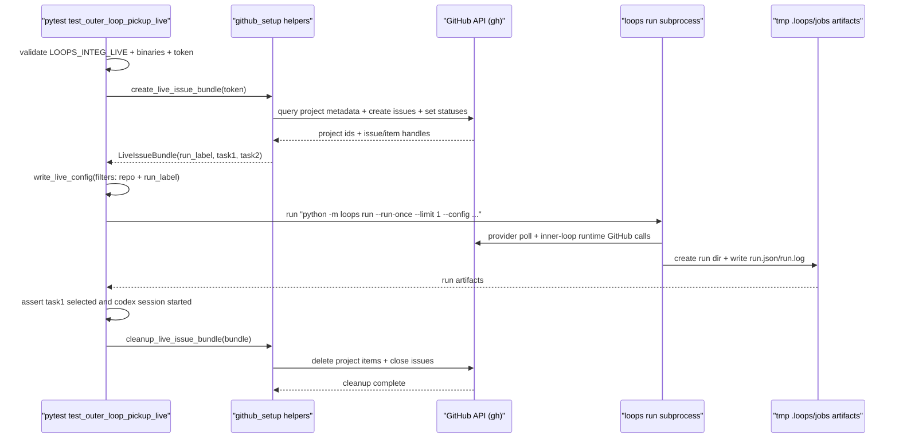

# Integration Test Harness Flow

Last updated: 2026-03-02

## Purpose / Question Answered

This document describes how live integration harness tests provision GitHub project tasks, run Loops with real Codex execution, and validate either pickup-only behavior or full lifecycle behavior.  
It answers:
- how `tests/integ/test_outer_loop_pickup_live.py` creates deterministic live test data, validates ready-task pickup, and cleans up safely.
- how `tests/integ/test_end2end_live.py` bootstraps `.integ/loops-integ`, validates approval-to-merge lifecycle completion, and performs teardown hygiene.

## Entry points

- `tests/integ/test_outer_loop_pickup_live.py:test_outer_loop_pickup_live`
- `tests/integ/test_end2end_live.py:test_end2end_live`
- `tests/integ/github_setup.py:create_live_issue_bundle`
- `tests/integ/github_setup.py:create_end2end_issue_bundle`
- `tests/integ/github_setup.py:cleanup_live_issue_bundle`
- `tests/integ/github_setup.py:cleanup_end2end_issue_bundle`

## Call path

### Phase 1: Test gating and runtime prerequisites

Trigger / entry condition:
- Pytest evaluates `test_outer_loop_pickup_live` while `LOOPS_INTEG_LIVE=1`.

Entrypoints:
- `tests/integ/test_outer_loop_pickup_live.py:test_outer_loop_pickup_live`

Ordered call path:
- Skip test unless `LOOPS_INTEG_LIVE` is set to `"1"` (`pytestmark` gate).
- Require `gh` and `codex` binaries in `PATH`.
- Resolve GitHub token (`GITHUB_TOKEN` or `GH_TOKEN`) with `require_github_token()`.
- Initialize cleanup tracking (`bundle=None`, `cleanup_error=None`) before setup begins.

State transitions / outputs:
- Input: process env and local toolchain.
- Output: validated runtime prerequisites plus token for setup/API calls.

Branch points:
- Missing opt-in env gate causes pytest skip.
- Missing binaries cause pytest skip.
- Missing GitHub token raises runtime error and fails test.

External boundaries:
- Local shell environment and executable lookup (`shutil.which`).

#### Sudocode (Phase 1: Test gating and runtime prerequisites)

Source: `tests/integ/test_outer_loop_pickup_live.py`

```ts
if LOOPS_INTEG_LIVE != "1":
  skip_test()

require_binary("gh")
require_binary("codex")
token = require_github_token() // GITHUB_TOKEN or GH_TOKEN

bundle = None
cleanup_error = None
```

### Phase 2: Provision deterministic live GitHub tasks

Trigger / entry condition:
- Phase 1 completed and token is available.

Entrypoints:
- `tests/integ/github_setup.py:create_live_issue_bundle`
- `tests/integ/github_setup.py:fetch_project_metadata`

Ordered call path:
- Parse project URL into owner/login/project number.
- Query project metadata to find `Status` field id and select ready + non-ready option ids.
- Build unique run label (`loops-integ-<timestamp>-<random>`).
- Ensure run label exists as a repo label.
- Create two issues (`task1` then `task2`) in `kevinslin/loops-integ`; sleep 1s between creates for deterministic ordering.
- Add both issues to the project board and assign statuses:
- `task1` -> ready option (`Todo`)
- `task2` -> non-ready option
- Return `LiveIssueBundle` with run label, issue handles, project ids, and item ids.

State transitions / outputs:
- Input: token, project URL, target repo.
- Output: `LiveIssueBundle` used to configure provider filters and later cleanup.

Branch points:
- If setup fails at any point, execute `_cleanup_partial_setup` (delete project items, close issues) before re-raising.
- Non-ready status selection falls back to first option id that differs from ready option when preferred candidates are unavailable.

External boundaries:
- `gh api graphql` for project metadata and item mutation.
- `gh api repos/.../issues` for issue create/close and label management.

#### Sudocode (Phase 2: Provision deterministic live GitHub tasks)

Source: `tests/integ/github_setup.py`

```ts
locator = parse_project_url(project_url)
project = fetch_project_metadata(locator, token)
run_label = build_run_label()

ensure_repo_label(repo, run_label, token)
task1 = create_issue(repo, title="[task1]", label=run_label, token)
sleep(1s) // keep created_at ordering deterministic
task2 = create_issue(repo, title="[task2]", label=run_label, token)

task1_item = add_issue_to_project(project.project_id, task1.node_id, token)
task2_item = add_issue_to_project(project.project_id, task2.node_id, token)

set_project_item_status(project.project_id, task1_item, project.status_field_id, project.ready_option_id, token)
set_project_item_status(project.project_id, task2_item, project.status_field_id, project.non_ready_option_id, token)

return LiveIssueBundle(run_label, task1+item, task2+item, project)
```

### Phase 3: Run Loops once and assert run artifacts

Trigger / entry condition:
- `LiveIssueBundle` exists and points to two project items with distinct readiness states.

Entrypoints:
- `tests/integ/test_outer_loop_pickup_live.py:write_live_config`
- `tests/integ/test_outer_loop_pickup_live.py:run_until_single_run_dir`

Ordered call path:
- Write `.loops/config.json` under `tmp_path` with:
- provider filters (`repository=kevinslin/loops-integ`, `tag=<run_label>`)
- ready status `Todo`
- `emit_on_first_run=true`, `force=true`, `sync_mode=true`
- inner loop command `python -m loops.inner_loop` and deterministic fast `CODEX_CMD`
- Build env for subprocess (`GITHUB_TOKEN`, `GH_TOKEN`, `PYTHONPATH`).
- Execute `python -m loops run --run-once --limit 1 --config <config_path>` with retry loop (`LOOPS_INTEG_POLL_ATTEMPTS`, delay between attempts).
- Detect exactly one run directory in `<tmp>/.loops/jobs`.
- Read `run.json` and assert:
- selected task title matches task1 title
- `needs_user_input` is true with expected message fragment (`without opening a PR`)
- Read `run.log` and assert Codex session started with no invocation/exit failure markers.

State transitions / outputs:
- Input: test config + live project tasks.
- Output: run directory artifacts proving outer-loop pickup and inner-loop/Codex invocation.

Branch points:
- `loops run` non-zero exit fails immediately with captured stdout/stderr.
- If zero run dirs are observed, retry until attempts are exhausted; final failure includes last command output.
- More than one run dir is treated as invariant violation and fails test.

External boundaries:
- Local subprocess invocation of `loops` CLI (which triggers provider polling, outer loop scheduling, and inner loop execution).
- GitHub API access through provider/inner loop subprocesses.

#### Sudocode (Phase 3: Run Loops once and assert run artifacts)

Source: `tests/integ/test_outer_loop_pickup_live.py`

```ts
write_live_config(config_path, run_label=bundle.run_label)
env = with_tokens_and_pythonpath(os.environ, token, repo_root)
command = [python, "-m", "loops", "run", "--run-once", "--limit", "1", "--config", config_path]

run_dir, result = run_until_single_run_dir(command, env, loops_root, timeout)
run_record = json_load(run_dir / "run.json")

assert run_record.task.title == bundle.task1.title
assert run_record.needs_user_input is true
assert "without opening a PR" in run_record.needs_user_input_payload.message

run_log = read_text(run_dir / "run.log")
assert "starting new codex session" in run_log
assert "codex invocation failed" not in run_log
assert "codex exit code " not in run_log
```

### Phase 4: Cleanup and error surfacing

Trigger / entry condition:
- `finally` block executes regardless of setup/run/assertion success.

Entrypoints:
- `tests/integ/test_outer_loop_pickup_live.py:test_outer_loop_pickup_live`
- `tests/integ/github_setup.py:cleanup_live_issue_bundle`

Ordered call path:
- If setup produced a bundle, attempt cleanup.
- Delete created project items from the project board.
- Close both created issues in `kevinslin/loops-integ`.
- Capture cleanup exception into `cleanup_error` without masking earlier assertion output.
- After `finally`, re-raise cleanup error if present.

State transitions / outputs:
- Input: `LiveIssueBundle` with project item ids and issue numbers.
- Output: test artifacts removed from project/repo, or explicit cleanup failure.

Branch points:
- Bundle missing means setup failed before issue creation, so no cleanup actions are attempted.
- Cleanup continues collecting per-item/per-issue failures and surfaces aggregated error text.

External boundaries:
- `gh api graphql` for item deletion.
- `gh api repos/.../issues/{n} -X PATCH -f state=closed` for issue closure.

#### Sudocode (Phase 4: Cleanup and error surfacing)

Source: `tests/integ/test_outer_loop_pickup_live.py`, `tests/integ/github_setup.py`

```ts
finally:
  if bundle is not None:
    try:
      cleanup_live_issue_bundle(bundle, token)
    except Exception as exc:
      cleanup_error = exc

if cleanup_error is not None:
  raise cleanup_error
```

### Phase 5: Full end-to-end lifecycle harness (`test_end2end_live`)

Trigger / entry condition:
- Pytest evaluates `test_end2end_live` while `LOOPS_INTEG_END2END=1`.

Entrypoints:
- `tests/integ/test_end2end_live.py:test_end2end_live`
- `tests/integ/test_end2end_live.py:bootstrap_integ_repo`
- `tests/integ/github_setup.py:create_end2end_issue_bundle`
- `tests/integ/test_end2end_live.py:write_end2end_config`
- `tests/integ/test_end2end_live.py:revert_merged_change`

Ordered call path:
- Skip unless `LOOPS_INTEG_END2END=1`; require `gh`, `git`, and `codex`.
- Clone-or-sync `.integ/loops-integ`, then run `loops init --force` under that repo.
- Create one ready "make animal" issue tagged with a unique run label and add it to the integration board.
- Write `.integ/loops-integ/.loops/config.json` with repository/run-label filters, `sync_mode=true`, and `auto_approve_enabled=true`.
- Run `python -m loops run --run-once --limit 1 --config ...` with a hard timeout (`LOOPS_INTEG_END2END_TIMEOUT_SECONDS`, default 900).
- Assert run artifacts and lifecycle outcomes from `run.json` plus GitHub APIs:
  - one run dir exists,
  - `last_state == DONE`,
  - PR exists and merged metadata is present,
  - `auto_approve.verdict == "APPROVE"`,
  - project item status equals resolved completed status option id (`Done` or `Completed`).
- Teardown:
  - revert merged commit in `.integ/loops-integ` and push,
  - run `loops clean --loops-root .integ/loops-integ/.loops`,
  - delete project item and close issue for created test artifacts.

State transitions / outputs:
- Input: live GitHub project + mutable target repo + local `.integ/loops-integ` checkout.
- Output: verified merged lifecycle evidence and clean post-run local/remote state.

Branch points:
- If merge evidence is missing, revert step is skipped but issue/project cleanup still runs.
- Cleanup errors are aggregated and surfaced after primary assertion handling.

External boundaries:
- `git` subprocesses for clone/sync/revert/push in `.integ/loops-integ`.
- `loops` subprocesses for `init`, `run`, and `clean`.
- `gh` API calls for setup, status assertions, and cleanup.

#### Sudocode (Pseudocode, Phase 5: Full end-to-end lifecycle harness)

Source: `tests/integ/test_end2end_live.py`, `tests/integ/github_setup.py`

```ts
if LOOPS_INTEG_END2END != "1":
  skip_test()

bootstrap_integ_repo(".integ/loops-integ")
bundle = create_end2end_issue_bundle(token, animal)
write_end2end_config(repo=".integ/loops-integ", filters=[repository, run_label])

run_dir = run_until_single_run_dir(
  "python -m loops run --run-once --limit 1 --config ...",
  timeout=900s,
)
run_record = read_json(run_dir / "run.json")
assert run_record.last_state == "DONE"
assert run_record.auto_approve.verdict == "APPROVE"
assert run_record.pr.merged_at != null
assert project_item_status(bundle.task.item_id) == bundle.project.completed_option_id

revert_merged_change(merge_commit_sha)
loops_clean(".integ/loops-integ/.loops")
cleanup_end2end_issue_bundle(bundle)
```

## State, config, and gates

### Core state values (source of truth and usage)

- `run_label`
  - Source: `build_run_label()` in `tests/integ/github_setup.py`.
  - Consumed by: issue labeling and provider filter (`tag=<run_label>`) in `write_live_config`.
  - Risk area: mismatch between issue label and config filter yields zero picked tasks.

- `LiveIssueBundle.task1/task2` and `item_id`
  - Source: `create_live_issue_bundle` return value.
  - Consumed by: task-title assertion (`task1`) and cleanup item deletion.
  - Risk area: missing `item_id` prevents project-item cleanup.

- `ProjectMetadata.ready_option_id` and `non_ready_option_id`
  - Source: `fetch_project_metadata` + `select_non_ready_option_id`.
  - Consumed by: `set_project_item_status` gate establishing one ready and one non-ready task.
  - Risk area: wrong option mapping causes nondeterministic pickup.

- `run_dir` under `<tmp>/.loops/jobs`
  - Source: `run_until_single_run_dir` filesystem poll.
  - Consumed by: `run.json` and `run.log` assertions.
  - Risk area: indexing delay can produce transient no-run attempts before retries succeed.

- `cleanup_error`
  - Source: `except` inside cleanup attempt.
  - Consumed by: post-finally re-raise.
  - Risk area: teardown failures can mask true harness stability if ignored.

### Statsig (or `None identified`)

None identified.

### Environment Variables (or `None identified`)

| Name | Where Read | Default | Effect on Flow |
|---|---|---|---|
| `LOOPS_INTEG_LIVE` | `tests/integ/test_outer_loop_pickup_live.py` (`pytestmark`) | unset | Enables/disables live integration test execution. |
| `LOOPS_INTEG_END2END` | `tests/integ/test_end2end_live.py` (`pytestmark`) | unset | Enables/disables full lifecycle live integration test execution. |
| `GITHUB_TOKEN` / `GH_TOKEN` | `tests/integ/github_setup.py:require_github_token`, `run_gh` env setup | none | Auth for GitHub issue/project mutations and provider polling. |
| `LOOPS_INTEG_CODEX_CMD` | `tests/integ/test_outer_loop_pickup_live.py` (`FAST_CODEX_CMD`) | deterministic default Codex prompt command | Controls inner-loop Codex command used during test run. |
| `LOOPS_INTEG_END2END_CODEX_CMD` | `tests/integ/test_end2end_live.py` (`END2END_CODEX_CMD`) | `codex exec --dangerously-bypass-approvals-and-sandbox` | Controls Codex command used during full lifecycle run. |
| `LOOPS_INTEG_TIMEOUT_SECONDS` | `tests/integ/test_outer_loop_pickup_live.py` | `300` | Per-attempt timeout for `loops run` subprocess. |
| `LOOPS_INTEG_END2END_TIMEOUT_SECONDS` | `tests/integ/test_end2end_live.py` | `900` | Hard timeout for end-to-end `loops run --run-once` execution. |
| `LOOPS_INTEG_POLL_ATTEMPTS` | `tests/integ/test_outer_loop_pickup_live.py:run_until_single_run_dir` | `3` | Number of retries when run dir is not yet materialized. |
| `LOOPS_INTEG_POLL_DELAY_SECONDS` | `tests/integ/test_outer_loop_pickup_live.py:run_until_single_run_dir` | `2.0` | Delay between `loops run` retries. |
| `LOOPS_INTEG_END2END_POLL_ATTEMPTS` | `tests/integ/test_end2end_live.py:run_until_single_run_dir` | `2` | Number of retries when end-to-end run dir is not yet materialized. |
| `LOOPS_INTEG_END2END_POLL_DELAY_SECONDS` | `tests/integ/test_end2end_live.py:run_until_single_run_dir` | `5.0` | Delay between end-to-end retries. |
| `LOOPS_INTEG_END2END_ANIMAL` | `tests/integ/test_end2end_live.py` | `otter` | Selects deterministic animal payload in the "make animal" issue body. |
| `LOOPS_INTEG_GH_TIMEOUT_SECONDS` | `tests/integ/github_setup.py:_resolve_gh_timeout_seconds` | `60.0` | Timeout for each `gh` command during setup/cleanup. |
| `PYTHONPATH` | `tests/integ/test_outer_loop_pickup_live.py:build_pythonpath` | inherited env | Ensures repository package importability in subprocess run. |

### Other User-Settable Inputs (or `None identified`)

| Name | Type | Where Read | Effect on Flow |
|---|---|---|---|
| `project_url` argument to `create_live_issue_bundle` | function arg | `tests/integ/github_setup.py` | Chooses target GitHub Projects board used by live test setup. |
| `repo` argument to `create_live_issue_bundle` | function arg | `tests/integ/github_setup.py` | Chooses repo where test issues are created and later closed. |
| `animal` argument to `create_end2end_issue_bundle` | function arg | `tests/integ/github_setup.py` | Controls deterministic payload for the full lifecycle "make animal" issue. |
| `.loops/config.json` payload from `write_live_config` | generated test config | `loops run --config ...` subprocess | Controls provider filters, ready status, sync mode, and inner loop command/env. |
| `.integ/loops-integ/.loops/config.json` payload from `write_end2end_config` | generated test config | `loops run --config ...` subprocess | Controls full lifecycle run settings including auto-approve and repository checkout root. |
| CLI flags `--run-once --limit 1 --config` | subprocess args | `python -m loops run` | Forces one-cycle pickup and deterministic single-task selection in the harness run. |

### Important gates / branch controls

- Live-test opt-in gate: `LOOPS_INTEG_LIVE == "1"` is required.
- Readiness gate: task1 is set to `Todo`; task2 is set to a non-ready status option.
- Provider isolation gate: filters require both target repository and run label tag.
- Run materialization gate: harness expects exactly one run dir (`len(run_dirs) == 1`).
- Codex health gate: `run.log` must show session start and no invocation/exit failure markers.

## Sequence diagram



## Observability

Metrics:
- None identified in test harness code; validation is assertion-driven.

Logs:
- `run.log` in generated run dir is checked for codex start and absence of codex failure markers.
- Captured `stdout`/`stderr` from failed `loops run` subprocess attempts are surfaced in assertion failures.
- `format_gh_error(...)` provides structured `gh` command diagnostics for setup/cleanup failures.

Useful debug checkpoints:
- `run_until_single_run_dir(...)`: confirms whether run dir creation lagged or never happened.
- `run.json` payload (`task.title`, `needs_user_input_payload.message`) to verify selected task and expected inner-loop outcome.
- `LiveIssueBundle` content (`run_label`, `item_id`) to troubleshoot provider filter misses and cleanup misses.

## Related docs

- `docs/specs/active/2026-02-09-create-integration-testing-harness-for-loops.md`
- `docs/specs/active/2026-03-01-end2end-integration-test-target.md`
- `docs/flows/ref.outer-loop.md`
- `docs/flows/ref.inner-loop.md`
- `README.md` (Development -> live integration harness section)

## Manual Notes 

[keep this for the user to add notes. do not change between edits]

## Changelog
- 2026-03-01: Created integration test harness flow doc for live setup, run, assertion, and cleanup behavior. (019cabf3-d850-7bb0-ba2c-53d1a13dfc6e)
- 2026-03-02: Added full lifecycle end-to-end live harness flow (`test_end2end_live`) including bootstrap, merge assertions, and teardown sequence. (019cacf8-0a3d-7601-b17c-9302a9f6fb4c)
