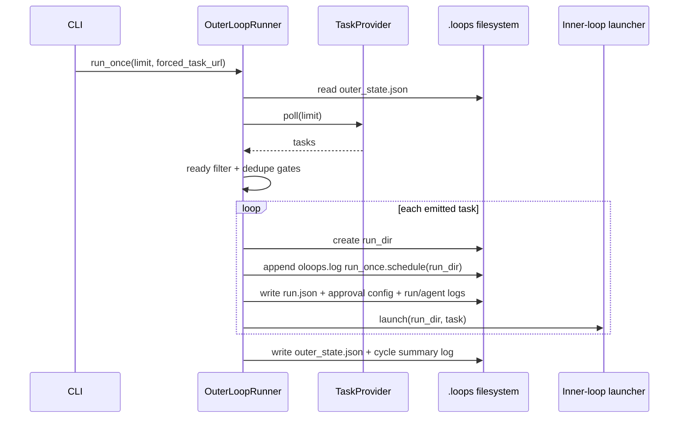

# Outer Loop Flow

Last updated: 2026-03-01

## Overview

This document describes how Loops discovers ready tasks, de-duplicates them, materializes per-task run directories, and launches inner-loop processes.
It is intended as a fast context-recapture artifact for humans and LLM agents changing outer-loop behavior.

**Related Documents:**
- `DESIGN.md`
- `README.md`
- `LAYOUT.md`
- `docs/flows/ref.inner-loop.md`
- `docs/specs/active/2026-02-05-implement-outer-loop-runner.md`
- `docs/specs/active/2026-02-03-implement-github-projects-v2-task-provider.md`

## Terminology

- `Outer loop`: Poll-and-dispatch runtime that turns provider tasks into run directories.
- `Outer state`: Dedup ledger in `.loops/outer_state.json` with `initialized`, `tasks`, `updated_at`.
- `Run dir`: Per-task folder under `.loops/jobs/` created by `create_run_dir`.
- `Launcher`: Callable that starts the configured inner-loop command with task/run env vars.
- `Ready task`: Provider task whose status matches `loop_config.task_ready_status` (case-insensitive).
- `Oldest-first provider order`: `github_projects_v2` returns matched tasks sorted by `task.created_at` ascending before `limit` is applied.

## Purpose / Question Answered

How does the outer loop convert provider tasks into inner-loop executions while preserving dedupe state, run-materialization ordering, and observable launch logs?

## Entry points

- CLI command `python -m loops run` (`loops/cli.py`) dispatches into `_run_outer_loop(...)`.
- `_run_outer_loop(...)` constructs `OuterLoopRunner` and calls `run_once(...)` or `run_forever(...)`.
- `OuterLoopRunner.run_once(...)` performs polling, selection, run-dir creation, and launch dispatch.

## Call path

#### Sudocode (outer-loop poll-and-dispatch)

Source: `loops/cli.py`, `loops/outer_loop.py`

```ts
function run_outer_loop_cycle(config_path, limit, force, task_url)
  config := load_config(config_path)
  provider := build_provider(config)
  launcher := build_inner_loop_launcher(config)
  runner := OuterLoopRunner(provider, config.loop_config, loops_root, launcher)

  created_run_dirs := runner.run_once(limit=limit, forced_task_url=task_url)
  return created_run_dirs

class OuterLoopRunner
  function run_once(limit=None, forced_task_url=None)
    state := read_outer_state(self.state_path)
    polled_tasks := self.provider.poll(limit_or_none)
    ready_tasks := select_ready_or_forced(polled_tasks, forced_task_url)
    emit_tasks := apply_emit_and_dedupe_rules(ready_tasks, state, self.config)

    for task in emit_tasks
      run_dir := create_run_dir(task, self.loops_root)
      _log(self.log_path, "run_once.schedule ... run_dir=<path>")
      write_run_record(run_dir / "run.json", initial_running_record(task))
      write_inner_loop_approval_config(run_dir, from_loop_config(self.config))
      ensure_file_exists(run_dir / "run.log")
      ensure_file_exists(run_dir / "agent.log")
      queue_for_launch(run_dir, task)

    launch_queued_tasks()
    persist_outer_state_in_finally()
```

## State, config, and gates

- Primary dedupe state lives in `.loops/outer_state.json` (`initialized`, `tasks`, `updated_at`).
- Emission gate is `emit_on_first_run || force || !first_run`.
- Dedupe gate skips already-seen tasks unless `force=true`.
- Launch gate requires `inner_loop_launcher` whenever `emit_tasks` is non-empty.
- Run materialization order is fixed: create run directory, log `run_once.schedule` with `run_dir`, write `run.json`, write approval config, touch logs, launch.
- For GitHub Projects V2, poll ordering is oldest-first by task `created_at`; outer loop preserves provider order when scheduling.

## Sequence diagram



## Config

### Statsig

None identified.

### Environment Variables

| Name | Where Read | Default | Effect on Flow |
|---|---|---|---|
| `GITHUB_TOKEN` / `GH_TOKEN` | `loops/providers/github_projects_v2.py:220` | none | Required by GitHub provider polling when `task_provider_config.github_token` is not set. |
| Process env passthrough (`os.environ.copy()`) | `loops/outer_loop.py`, `loops/providers/github_projects_v2.py:236` | N/A | Baseline environment passed to inner-loop child and `gh api graphql` subprocesses. |
| `LOOPS_RUN_DIR` (child env) | set in `loops/outer_loop.py` launcher | required by inner-loop CLI/module fallback path | Selects the per-run directory to execute when child command does not pass `--run-dir`. |

### Other User-Settable Inputs

| Name | Type | Where Read | Effect on Flow |
|---|---|---|---|
| `--config` | CLI option | `loops/cli.py:38`, consumed in `loops/cli.py:196` | Selects config file for provider/loop/inner-loop settings and loops root resolution. |
| `--run-once/--run-forever` | CLI option | `loops/cli.py:46`, dispatched at `loops/cli.py:217` | Controls single-cycle execution vs continuous polling loop. |
| `--limit` | CLI option | `loops/cli.py:51`, forwarded to provider poll | Caps tasks returned/considered in a cycle (for `github_projects_v2`, after oldest-first ordering). |
| `--force` | CLI option | `loops/cli.py:57`, override at `loops/cli.py:198` | Reprocesses tasks even if previously seen in outer state. |
| `task_provider_id` / `task_provider_config.*` | Config file fields | `loops/outer_loop.py:243`, `loops/outer_loop.py:274` | Chooses task provider and provider-specific polling behavior. |
| `loop_config.*` | Config file fields | `loops/outer_loop.py:394` | Controls poll interval, ready filter, sync mode, emit-on-first-run, force, parallel launch behavior, and run-scoped inner-loop runtime settings. |
| `inner_loop.*` | Config file fields | `loops/outer_loop.py:44`, `loops/outer_loop.py:283` | Defines launch command, cwd, run-scoped runtime env payload, and URL appending for child processes. |

## Flow

### Entry assumptions and boundaries

- Operator enters via `python -m loops run ...`, handled by CLI (`loops/cli.py:36`).
- `_run_outer_loop` assembles a runner from config + provider + launcher (`loops/cli.py:187`).
- Outer loop creates and updates `.loops/outer_state.json`, `.loops/oloops.log`, and `.loops/jobs/<run>/...`.
- Inner-loop execution boundary begins at launcher invocation (`loops/outer_loop.py:293`).

### State Timeline Table

| value | write step | snapshot step | read step | ordering valid? |
|---|---|---|---|---|
| `outer_state.initialized` | Set true in `run_once` finally block (`loops/outer_loop.py:203`) and persisted (`loops/outer_loop.py:205`) | Loaded at cycle start (`loops/outer_loop.py:163`) | Used to compute first-run emission policy (`loops/outer_loop.py:169`) | Yes |
| `outer_state.tasks` ledger | Updated per ready task via `record_task` (`loops/outer_loop.py:174`) then persisted (`loops/outer_loop.py:205`) | Loaded at cycle start (`loops/outer_loop.py:163`) | Used by `has_task` dedupe gate (`loops/outer_loop.py:173`) | Yes |
| `ready_tasks` | Created from provider poll filtered by `_is_ready` (`loops/outer_loop.py:164`) | Snapshot per cycle in memory | Used to build emit set and log counts (`loops/outer_loop.py:172`, `loops/outer_loop.py:206`) | Yes |
| `emit_tasks` | Built in cycle loop (`loops/outer_loop.py:168`, `loops/outer_loop.py:179`) | Snapshot before launch (`loops/outer_loop.py:183`) | Drives run-dir creation + launcher dispatch (`loops/outer_loop.py:184`, `loops/outer_loop.py:199`) | Yes |
| `run.json` initial state | Written by `write_run_record` (`loops/outer_loop.py:194`) | Materialized before launcher call | Consumed by inner loop as authoritative starting state | Yes |
| `inner_loop_approval_config.json` | Written in run dir from `loop_config.approval_comment_*` plus provider review-actor allowlist before launch | Materialized before launcher call | Consumed by inner loop PR poller config loader | Yes |
| `inner_loop_runtime_config.json` | Written in launcher from `loop_config` + `inner_loop.env` | Materialized before child process execution | Consumed by inner loop for handoff handler, auto-approve flag, sync-mode log mirroring, and runtime env map | Yes |
| `oloops.log` cycle summary | Appended in finally block (`loops/outer_loop.py:206`, formatter at `loops/outer_loop.py:493`) | N/A | Used for operational summaries (`ready`/`processed`) | Yes |

### Outer-loop runtime invocation

- `loops/cli.py:187` + `loops/outer_loop.py:158`
```ts
function _run_outer_loop(config_path, run_once, limit, force, task_url=None)
  config := load_config(config_path)
  effective_loop_config := config.loop_config with CLI overrides from force and task_url
  config := replace(config, loop_config=effective_loop_config)

  if config.inner_loop is None
    config := replace(
      config,
      inner_loop=InnerLoopCommandConfig(
        command=[sys.executable, "-m", "loops.inner_loop"],
        append_task_url=False,
      ),
    )

  runner := OuterLoopRunner(
    :=config,
    loops_root=_resolve_loops_root(config_path),
  )

  effective_run_once := run_once or task_url is not None
  if effective_run_once
    runner.run_once(limit=limit, forced_task_url=task_url)
  else
    runner.run_forever(limit=limit) {
      while True
        self.run_once(limit=limit)
        time.sleep(self.config.poll_interval_seconds)
    }

class OuterLoopRunner
  function run_once(limit=None, forced_task_url=None)
    self.loops_root.mkdir(parents=True, exist_ok=True)
    (self.loops_root / INNER_LOOP_RUNS_DIR_NAME).mkdir(parents=True, exist_ok=True)

    state := read_outer_state(self.state_path)
    poll_limit := None if forced_task_url is not None else limit
    polled_tasks := self.provider.poll(poll_limit)

    if forced_task_url is not None
      ready_tasks := [_select_task_by_url(polled_tasks, forced_task_url)]
    else
      ready_tasks := [
        task
        for task in polled_tasks
        if task.status.casefold() == self.config.task_ready_status.casefold()
      ]

    now_iso := _now_iso()
    emit_tasks := []
    first_run := not state.initialized
    should_emit := self.config.emit_on_first_run or self.config.force or not first_run

    for task in ready_tasks
      already_seen := state.has_task(task)
      state.record_task(task, now_iso)

      if not should_emit
        continue
      if already_seen and not self.config.force
        continue
      emit_tasks.append(task)

    if emit_tasks and self.inner_loop_launcher is None
      raise RuntimeError("inner_loop_launcher is required to launch tasks")

    to_launch := []
    for task in emit_tasks
      run_dir := create_run_dir(task, self.loops_root)
      _log(self.log_path, "run_once.schedule key=<provider:id> url=<task-url> run_dir=<path>")
      write_run_record(
        run_dir / "run.json",
        RunRecord(
          task=task,
          pr=None,
          codex_session=None,
          needs_user_input=False,
          last_state="RUNNING",
          updated_at=now_iso,
        ),
      )
      to_launch.append((run_dir, task))

    try
      if to_launch
        self._launch_tasks(to_launch)
    finally
      state.initialized = True
      state.updated_at = now_iso
      write_outer_state(self.state_path, state)
      _log(self.log_path, f"ready={len(ready_tasks)} processed={len(to_launch)}")

    return [run_dir for run_dir, _ in to_launch]

  function _launch_tasks(tasks)
    launcher := self.inner_loop_launcher
    if launcher is None
      raise RuntimeError("inner_loop_launcher is required to launch tasks")

    if self.config.sync_mode
      for run_dir, task in tasks
        launcher(run_dir, task)
      return

    if not self.config.parallel_tasks or len(tasks) <= 1
      for run_dir, task in tasks
        launcher(run_dir, task)
      return

    with ThreadPoolExecutor(
      max_workers=min(self.config.parallel_tasks_limit, len(tasks))
    ) as executor
      futures := [executor.submit(launcher, run_dir, task) for run_dir, task in tasks]
      for future in futures
        future.result()
```

### Child-launch behavior and handoff contract

- `build_inner_loop_launcher` builds a closure that:
  - Persists run-scoped runtime settings to `inner_loop_runtime_config.json` (handoff handler, auto-approve flag, sync-mode log mirroring flag, and optional `inner_loop.env` payload).
  - Injects only `LOOPS_RUN_DIR` into child env for run-dir resolution compatibility.
  - Appends task URL to command when configured (`loops/outer_loop.py:307`).
  - Uses `subprocess.run` in `sync_mode=true` (`loops/outer_loop.py:310`) or detached `subprocess.Popen` writing to `run.log` (`loops/outer_loop.py:319`).
- Approval-comment settings and provider review-actor allowlist are persisted per run as `inner_loop_approval_config.json`, not injected via env.

### Provider polling behavior (GitHub Projects V2)

- `build_provider` currently supports only `github_projects_v2` (`loops/outer_loop.py:274`).
- Provider flow (`loops/providers/github_projects_v2.py:164`):
  - Resolve token (config override, else env) (`loops/providers/github_projects_v2.py:220`).
  - Parse project URL (`loops/providers/github_projects_v2.py:32`).
  - Poll GraphQL pages via `gh api graphql`, map items to `Task`, stop at limit or pagination end (`loops/providers/github_projects_v2.py:172`).

**File(s)**: `loops/cli.py`, `loops/outer_loop.py`, `loops/providers/github_projects_v2.py`, `loops/run_record.py`

## Architecture Diagram

```text
+-------------------------+
| CLI: loops run          |
| (config/run-once/limit) |
+-----------+-------------+
            |
            v
+-------------------------+
| _run_outer_loop         |
| load config             |
| build provider          |
| build launcher          |
+-----------+-------------+
            |
            v
+-------------------------+
| OuterLoopRunner.run_once|
| - read outer_state      |
| - provider.poll         |
| - ready filter          |
| - dedupe/force gating   |
| - create run dirs/files |
| - launch inner loops    |
| - write outer_state/log |
+-------+-----------+-----+
        |           |
        |           v
        |   +----------------------+
        |   | .loops/oloops.log    |
        |   | .loops/outer_state   |
        |   +----------------------+
        v
+-------------------------------+
| inner-loop launcher closure   |
| sets LOOPS_TASK_* + RUN_DIR   |
| run(sync) or popen(detached)  |
+-------------------------------+
        |
        v
+-------------------------------+
| .loops/jobs/<run>/            |
| run.json, run.log, agent.log  |
+-------------------------------+
```

## Metrics

No dedicated metrics emitter exists in code today.

Useful derived metrics:

- Ready count per poll cycle (`ready` from `oloops.log` entries).
- Processed/launched count per poll cycle (`processed` from `oloops.log`).
- Launch throughput (`processed` over time).
- Dedupe rate (`ready - processed` in steady state without force).
- First-run suppression effect (`emit_on_first_run=false` yields `processed=0` on first cycle).

## Logs

Key outer-loop logs and emit sites:

- Per-task schedule log after run-dir allocation: `run_once.schedule key=<provider:id> url=<task-url> run_dir=<path>` (`loops/outer_loop.py`).
- Per-cycle summary log: `_log(self.log_path, _format_log_line(...))` (`loops/outer_loop.py:206`).
- Log format payload: `ready=<n> processed=<m>` (`loops/outer_loop.py:493`).
- Log sink file: `.loops/oloops.log` (`loops/outer_loop.py:156`).
- In `sync_mode=true`, outer-loop log writes are mirrored to stdout while still appended to `.loops/oloops.log`.

Related launch output behavior:

- Detached mode routes child stdout/stderr to per-run `run.log` (`loops/outer_loop.py:319`).
- Sync mode uses foreground `subprocess.run`, does not detach, and enables inner-loop `run.log` stdout mirroring (`loops/outer_loop.py:310`).
- In sync mode, `Ctrl+C` during foreground launch prints resume guidance for `loops inner-loop --run-dir ...` before CLI abort.

## FAQ

Q: Why can `run_once` find ready tasks but launch none?
A: On first run with `emit_on_first_run=false`, tasks are recorded in outer state but intentionally not emitted (`loops/outer_loop.py:170`, `loops/outer_loop.py:175`).

Q: What is the difference between dedupe and force?
A: Dedupe skips already-seen tasks (`has_task`), while `force=true` bypasses that check and re-launches (`loops/outer_loop.py:173`, `loops/outer_loop.py:177`).

Q: When does outer state persist if launch fails?
A: State write happens in `finally`, so initialization and task ledger updates persist even when launcher raises (`loops/outer_loop.py:199`, `loops/outer_loop.py:205`).

Q: How is `loops_root` chosen?
A: If config is inside `.loops/`, that directory is used; otherwise `.loops/` is created adjacent to config (`loops/cli.py:275`).

Q: How do review polling allowlists reach inner loop?
A: `loop_config` approval settings and GitHub provider review-actor allowlist (`task_provider_config.allowlist`) are written into each run directory as `inner_loop_approval_config.json`, which inner loop reads at startup.

Q: How does handoff handler selection reach inner loop?
A: Outer loop writes `loop_config.handoff_handler` into run-scoped `inner_loop_runtime_config.json`, which inner loop reads at startup.

Q: What happens if I press `Ctrl+C` during a sync-mode inner-loop run?
A: Loops prints a resume command for the interrupted run directory so you can continue with `loops inner-loop --run-dir <path>`.

## Manual Notes 

[keep this for the user to add notes. do not change between edits]

## Changelog
- 2026-03-01: Replaced launcher env-based inner-loop config transport with run-scoped `inner_loop_runtime_config.json`; outer loop now injects only `LOOPS_RUN_DIR` into child env. (019caae6-1189-7d83-a9cd-1665818fba36)
- 2026-03-01: Renamed outer config schema references to `task_provider_id`/`task_provider_config` (v2) and aligned provider/filter docs accordingly. (019caa8b-0807-7603-a519-4a6be2b8e53c)
- 2026-03-01: Documented sync-mode `Ctrl+C` resume instructions for interrupted foreground launches. (019caa47-6d09-7cf1-a25a-83245c71f987)
- 2026-02-28: Removed configurable log timestamp precision; log timestamps are local no-timezone format with fixed fractional precision. (019ca742-f800-78a3-a5f3-11d807a04164)
- 2026-02-16: Created outer-loop flow doc covering poll, dedupe, run materialization, and launch semantics. (019c6863-d581-7f83-9809-fabbefa042e8)
- 2026-02-16: Revised outer-loop pseudocode to use grepable runtime names and focus on main execution flow over plumbing details. (019c6863-d581-7f83-9809-fabbefa042e8)
- 2026-02-16: Inlined short helper references in pseudocode to make the outer-loop flow readable in a single linear pass. (019c6863-d581-7f83-9809-fabbefa042e8)
- 2026-02-16: Switched run-forever pseudocode to keep the function call and inline its body at the call site. (019c6863-d581-7f83-9809-fabbefa042e8)
- 2026-02-17: Documented OuterLoopConfig comment-approval fields and run-scoped approval-config file handoff to inner loop. (019c68ed-a6c5-78e0-891a-6b70a1a1450c)
- 2026-02-19: Documented `loop_config.handoff_handler` and `LOOPS_HANDOFF_HANDLER` propagation into inner-loop runtime. (019c747a-a05e-7be1-b09d-66c5debb37c4)
- 2026-02-28: Added schedule-log coverage noting per-task `run_once.schedule` entries include the created run directory path. (019ca550-9ae5-7393-b5e6-e5e68e6c959d)
- 2026-02-28: Documented sync-mode stdout log mirroring for outer-loop logs and `LOOPS_STREAM_LOGS_STDOUT` propagation into inner-loop runs. (019ca579-eb69-7883-a6a5-ff48348ca2ab)
- 2026-03-01: Documented provider-scoped review-actor allowlist propagation into run-scoped `inner_loop_approval_config.json`. (019caa52-baf6-7913-b365-3c89049a5716)
