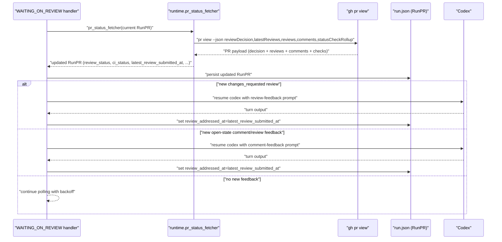

# PR Status Fetcher Flow

Last updated: 2026-03-02

## Purpose / Question Answered

This document explains how `runtime.pr_status_fetcher` computes PR review/CI state from GitHub data, with emphasis on how review events differ from plain discussion comments.
It also documents how those signals are surfaced to the agent: when Loops resumes Codex, which prompt variant it uses, and what context is intentionally omitted.

## Entry points

- `loops/core/inner_loop.py:run_inner_loop`: wires `runtime.pr_status_fetcher` (default closure or injected override).
- `loops/core/inner_loop.py:_handle_waiting_on_review_state`: polls `runtime.pr_status_fetcher` and decides whether to re-run Codex for review feedback.
- `loops/core/inner_loop.py:_handle_pr_approved_state`: reuses `runtime.pr_status_fetcher` for merge-state polling.
- `loops/core/inner_loop.py:_fetch_pr_status_with_gh_with_context`: default fetcher implementation and signal normalization.
- `loops/core/inner_loop.py:_run_codex_turn`: selects review-feedback vs comment-feedback prompt and updates `review_addressed_at`.

## Call path

### Phase 1: Fetcher wiring and runtime snapshot

Trigger / entry condition:
- `run_inner_loop(...)` starts and `InnerLoopRuntimeContext` is initialized.

Entrypoints:
- `loops/core/inner_loop.py:run_inner_loop`
- `loops/core/inner_loop.py:_load_comment_approval_settings`

Ordered call path:
- Load run-scoped comment-approval settings from `inner_loop_runtime_config.json` (legacy approval-file fallback supported for older runs).
- If caller did not inject `pr_status_fetcher`, create `_default_pr_status_fetcher` closure.
- Closure delegates to `_fetch_pr_status_with_gh_with_context(...)` and logs comment-based approval attribution.
- Store the chosen fetcher on `runtime.pr_status_fetcher`.

State transitions / outputs:
- Input: run directory, environment, optional injected `pr_status_fetcher`.
- Output: immutable runtime context containing fetcher + approval settings snapshot.

Branch points:
- If `pr_status_fetcher` is provided, default GH polling logic is bypassed.
- Invalid approval regex falls back to `DEFAULT_APPROVAL_COMMENT_PATTERN`.

External boundaries:
- None identified.

#### Sudocode (Phase 1: Fetcher wiring and runtime snapshot)

```ts
// Source: loops/core/inner_loop.py (run_inner_loop, _load_comment_approval_settings)
function run_inner_loop(..., pr_status_fetcher=None):
  comment_approval = load_comment_approval_settings(run_dir)

  if pr_status_fetcher is None:
    pr_status_fetcher = (pr) => {
      [updated_pr, approved_by_comment, approved_by] =
        fetch_pr_status_with_gh_with_context(pr, comment_approval, append_log)
      if approved_by_comment:
        append_log("treating PR as approved via allowlisted approval comment")
      return updated_pr
    }

  runtime = InnerLoopRuntimeContext(pr_status_fetcher=pr_status_fetcher, ...)
```

### Phase 2: GitHub fetch and signal normalization

Trigger / entry condition:
- Inner loop enters `WAITING_ON_REVIEW` or `PR_APPROVED` and calls `runtime.pr_status_fetcher(run_record.pr)`.

Entrypoints:
- `loops/core/inner_loop.py:_handle_waiting_on_review_state`
- `loops/core/inner_loop.py:_handle_pr_approved_state`
- `loops/core/inner_loop.py:_fetch_pr_status_with_gh_with_context`

Ordered call path:
- Call `gh pr view <pr-url> --json reviewDecision,mergedAt,url,number,latestReviews,reviews,comments,statusCheckRollup`.
- Parse payload and normalize `url`, `repo`, `number`, `merged_at`, `ci_status`, timestamps.
- Map `reviewDecision` to `review_status` (`approved` / `changes_requested` / `open`).
- Seed `latest_review_submitted_at` from `latestReviews` matching `reviewDecision`.
- If not already approved:
- Evaluate allowlisted approval signals from plain comments (`comments`) and review bodies (`reviews` state in `COMMENTED|APPROVED`) matching regex.
- Only override to approved when approval signal is newer than latest `CHANGES_REQUESTED`.
- If still `open`, treat newest timestamp across `reviews(state=COMMENTED)` and plain `comments` as feedback signal.
- Return updated `RunPR`, preserving incoming `review_addressed_at`.

State transitions / outputs:
- Input: current `RunPR` from `run.json`.
- Output: refreshed `RunPR` (`review_status`, `ci_status`, `merged_at`, `latest_review_submitted_at`, poll timestamps).

Branch points:
- `gh` non-zero exit or invalid JSON raises; caller handles backoff/escalation.
- Allowlisted approval signal can come from comment body or review body; newest wins.
- Newer `CHANGES_REQUESTED` blocks stale approval overrides.
- For `open` reviews, feedback signal source is whichever is newer:
- `reviews` entries with `state=COMMENTED`
- Plain PR discussion `comments`

External boundaries:
- `gh` CLI subprocess call to GitHub PR API.

#### Sudocode (Phase 2: GitHub fetch and signal normalization)

```ts
// Source: loops/core/inner_loop.py (_fetch_pr_status_with_gh_with_context and helpers)
function fetch_pr_status_with_gh_with_context(pr, comment_approval):
  payload = gh_pr_view(pr.url, fields=GH_PR_VIEW_JSON_FIELDS)

  review_status = review_status_from_decision(payload.reviewDecision)
  latest_review_submitted_at =
    extract_latest_review_submitted_at(payload, payload.reviewDecision)

  if review_status != "approved":
    latest_changes_requested_at =
      extract_latest_review_submitted_at(payload, "CHANGES_REQUESTED")

    approval_signal = newest(
      extract_latest_allowlisted_approval_comment(payload, comment_approval), // comments[]
      extract_latest_allowlisted_approval_review(payload, comment_approval),  // reviews[]
    )
    if approval_signal and approval_signal.timestamp > latest_changes_requested_at:
      review_status = "approved"
      latest_review_submitted_at = approval_signal.timestamp

    if review_status == "open":
      feedback_signal = newest(
        extract_latest_commented_review_feedback(payload), // reviews[state=COMMENTED]
        extract_latest_plain_comment_feedback(payload),    // comments[]
      )
      if feedback_signal:
        latest_review_submitted_at = feedback_signal.timestamp

  return RunPR(
    review_status=review_status,
    ci_status=ci_status_from_rollup(payload.statusCheckRollup),
    latest_review_submitted_at=latest_review_submitted_at,
    review_addressed_at=pr.review_addressed_at, // preserved
    ...
  )
```

### Phase 3: Agent-facing presentation and Codex resume

Trigger / entry condition:
- `_handle_waiting_on_review_state` has persisted refreshed PR data and evaluates whether feedback is new.

Entrypoints:
- `loops/core/inner_loop.py:_handle_waiting_on_review_state`
- `loops/core/inner_loop.py:_should_resume_review_feedback`
- `loops/core/inner_loop.py:_run_codex_turn`
- `loops/core/inner_loop.py:_build_review_feedback_prompt`
- `loops/core/inner_loop.py:_build_comment_feedback_prompt`

Ordered call path:
- Persist refreshed `RunPR` to `run.json`.
- Compute `should_resume` using `_should_resume_review_feedback(pr)`:
- `changes_requested`: resume only when `_is_new_review(...)` is true.
- `open` with comment/review feedback timestamp: resume only when `_is_new_review(...)` is true.
- If resuming:
- For `review_status == changes_requested`, use review-feedback prompt.
- For `review_status == open` feedback, use comment-feedback prompt.
- Run Codex turn with `review_feedback=True`.
- After successful review-feedback turn, set `review_addressed_at = latest_review_submitted_at` to prevent duplicate re-invocation.

State transitions / outputs:
- Input: refreshed PR signal timestamps + prior `review_addressed_at`.
- Output: either a resumed Codex turn or continued polling with backoff.

Branch points:
- Prompt variant is chosen by normalized `review_status`:
- `changes_requested` -> “has changes requested” prompt.
- `open` with new feedback signal -> “has new discussion comments” prompt.
- No new signal (`latest_review_submitted_at <= review_addressed_at`) means no agent re-invocation.

External boundaries:
- Codex subprocess invocation when resuming.

#### Sudocode (Phase 3: Agent-facing presentation and Codex resume)

```ts
// Source: loops/core/inner_loop.py (_handle_waiting_on_review_state, _run_codex_turn)
function handle_waiting_on_review_state(run_record, runtime):
  updated_pr = runtime.pr_status_fetcher(run_record.pr)
  run_record = write_run_record(pr=updated_pr)

  if should_resume_review_feedback(run_record.pr):
    if run_record.pr.review_status == "changes_requested":
      log("review changes requested; resuming codex")
    else:
      log("new PR comment feedback detected; resuming codex")

    run_record = run_codex_turn(review_feedback=true)
    // run_codex_turn selects prompt:
    // - build_review_feedback_prompt for changes_requested
    // - build_comment_feedback_prompt for open/comment feedback
    // and sets review_addressed_at = latest_review_submitted_at after review-feedback turn
```

## State, config, and gates

### Core state values (source of truth and usage)

- `runtime.pr_status_fetcher`
  - Source: `run_inner_loop(...)` runtime initialization.
  - Consumed by: `_handle_waiting_on_review_state`, `_handle_pr_approved_state`.
  - Risk area: injected custom fetchers can diverge from default semantics.

- `RunPR.review_status`
  - Source: `_review_status_from_decision(reviewDecision)` with optional allowlisted override.
  - Consumed by: `_derive_state`, `_should_resume_review_feedback`, prompt selection in `_run_codex_turn`.

- `RunPR.latest_review_submitted_at`
  - Source: newest decision-specific review, approval signal, or open-feedback signal.
  - Consumed by: `_is_new_review` and `review_addressed_at` dedupe.
  - Risk area: timestamp ordering is string-based ISO comparison; malformed timestamps degrade correctness.

- `RunPR.review_addressed_at`
  - Source: persisted in `run.json`; set after review-feedback codex turns.
  - Consumed by: `_is_new_review` to avoid duplicate feedback turns.

- `comments[]` vs `reviews[]` payloads
  - Source: `gh pr view --json ... comments,reviews`.
  - Consumed by:
  - Approval override logic (`/approve`-style regex on allowlisted users) for both sources.
  - Open-feedback selection (`reviews[state=COMMENTED]` and plain `comments`) for re-invocation timing.

### Statsig (or `None identified`)

None identified.

### Environment Variables (or `None identified`)

| Name | Where Read | Default | Effect on Flow |
|---|---|---|---|
| `GITHUB_TOKEN` / `GH_TOKEN` | `gh` subprocess environment in `_fetch_pr_status_with_gh_with_context` | environment-dependent | Determines whether `gh pr view` can read PR review/comment/check data. |
| `LOOPS_AUTO_APPROVE_ENABLED` | `_load_auto_approve_enabled` | `false` | Enables downstream auto-approve evaluation path after PR polling while status remains not-approved. |
| `CODEX_CMD` | `_resolve_codex_command` | `codex exec --yolo` | Controls how review/comment feedback is presented to the agent when Codex is resumed. |

### Other User-Settable Inputs (or `None identified`)

| Name | Type | Where Read | Effect on Flow |
|---|---|---|---|
| `task_provider_config.approval_comment_usernames` | config field | validated by provider, then written by outer loop to `inner_loop_runtime_config.json`, read by `_load_comment_approval_settings` | Enables allowlisted approval signals from comments/reviews. |
| `task_provider_config.approval_comment_pattern` | config field (regex text) | `inner_loop_runtime_config.json` -> `_load_comment_approval_settings` | Defines which comment/review bodies count as approval signals. |
| `pr_status_fetcher` parameter | runtime dependency injection | `run_inner_loop(..., pr_status_fetcher=...)` | Replaces default GH-backed normalization logic (used mainly in tests). |
| `run.json.pr.review_addressed_at` | persisted state field | read/write in `_is_new_review` and `_run_codex_turn` | Prevents reprocessing the same review/comment feedback event. |

### Important gates / branch controls

- `review_status != "approved"`: enables allowlisted approval override and open-feedback signal derivation.
- `approval_timestamp > latest_changes_requested_at`: blocks stale approval comments/reviews from overriding newer requested changes.
- `_select_newer_feedback_signal(...)`: picks newest timestamp between `COMMENTED` review events and plain PR comments.
- `_should_resume_review_feedback(...)`: resumes agent only for new feedback (`latest_review_submitted_at > review_addressed_at`).
- `_run_codex_turn(..., review_feedback=True)`: chooses review-vs-comment feedback prompt.

## Sequence diagram



## Observability

Metrics:
- None implemented for this flow.

Logs:
- `"[loops] polling PR status via gh: ..."` at fetch start.
- `"[loops] using latest COMMENTED review as feedback signal: ..."` when review comment events win.
- `"[loops] using latest plain PR comment as feedback signal: ..."` when plain comments win.
- `"[loops] PR status poll result: ..."` with normalized status summary.
- `"[loops] review changes requested; resuming codex"` and `"[loops] new PR comment feedback detected; resuming codex"` when agent re-invocation occurs.

Useful debug checkpoints:
- Validate fetched JSON field set via `GH_PR_VIEW_JSON_FIELDS`.
- Compare `latest_review_submitted_at` vs `review_addressed_at` when debugging duplicate or missing Codex re-invocations.
- Inspect final prompt variant in `CodexSession.last_prompt` and `run.log` when verifying agent-facing behavior.

## Related docs

- `docs/flows/ref.inner-loop.md`
- `DESIGN.md`
- `docs/specs/active/2026-02-17-allow-comment-based-pr-approval.md`
- `tests/test_inner_loop.py`

## Manual Notes 

[keep this for the user to add notes. do not change between edits]

## Changelog
- 2026-03-01: Created flow doc for `runtime.pr_status_fetcher`, including review/comment signal differences and agent-facing prompt behavior. (019caa54-4d1b-7712-9f8c-de8271aa0e30)
